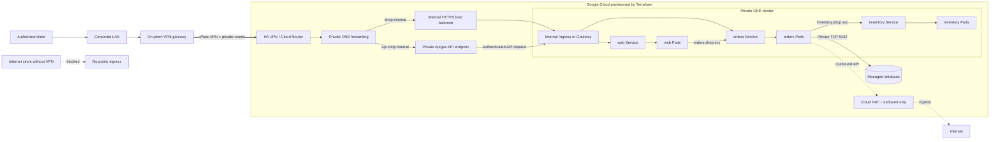
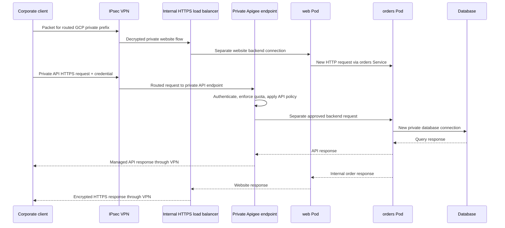

# Case Study: Terraform-Managed GKE Microservices Network

This case study applies the theory chapters after the concepts have been learned
independently. It follows one customer request through a realistic cloud design
and shows where Terraform, Google Cloud, Kubernetes, and application protocols
meet.

The example is architectural rather than a copy-and-run deployment. Production
choices depend on availability, compliance, cost, identity, and the selected GKE
networking mode.

## Scenario

ShopNow runs three microservices on a private GKE cluster:

- `web` serves the customer-facing application.
- `orders` validates and stores orders.
- `inventory` checks stock.

Authorized users and partner systems operate on a controlled corporate client
network. That network must establish a site-to-site VPN to the GCP VPC before it
can resolve or route to the private website and managed order API. There is no
direct public ingress path to those GCP resources.

Apigee governs the private API boundary with authentication, quotas, threat
protection, version routing, and analytics. Terraform provisions the GCP network,
HA VPN and Cloud Router, private DNS, internal HTTPS load balancer, private GKE
cluster, Cloud NAT, firewall rules, and the supporting Apigee infrastructure and
connectivity. Kubernetes manifests deploy the workloads, Services, Ingress or
Gateway resources, and NetworkPolicy.

!!! note "Client network, not individual VPN software"
    This design uses Google Cloud HA VPN as a **site-to-site** connection between the corporate client network and the GCP VPC. Google Cloud VPN is not a native client VPN for individual laptops. Remote users must first join the corporate network through an approved remote-access solution, or the architecture must use a separately designed zero-trust access service.

## Architecture



The editable source diagram is available as
`diagrams/shopnow-network-architecture.drawio` at the repository root.

## Addressing plan

| Network role | Example range or endpoint | Owner |
|:-------------|:--------------------------|:------|
| Corporate client LAN | `192.168.1.0/24` | On-premises network |
| VPN tunnel interfaces | Link-local `/30` ranges where required | On-prem VPN and Cloud Router |
| GKE nodes | `10.10.0.0/20` | GCP VPC subnet |
| GKE Pods | `10.20.0.0/16` | GKE secondary range |
| GKE Services | `10.30.0.0/20` | GKE secondary range |
| Database | Private address in an approved service range | Managed database service |
| Website frontend | Private HTTPS address, TCP 443 | Internal HTTPS load balancer |
| Managed API | `api.shop.internal`, TCP 443 | Privately exposed Apigee environment/API proxy |

The ranges are examples, not universal defaults. The design requirement is that
VPC, Pod, Service, on-premises, and connected-network ranges do not overlap and
have sufficient capacity. Review [Packets & IP Addressing](02-packets-ip-addressing.md)
and [Subnetting & DHCP](06-subnetting-dhcp.md) before selecting them.

## Infrastructure ownership

| Concern | Terraform/GCP responsibility | Kubernetes responsibility |
|:--------|:-----------------------------|:--------------------------|
| Address space | VPC, subnet, secondary ranges | Pod and Service allocation from assigned ranges |
| Private client connectivity | HA VPN, Cloud Router/BGP or static routes, and return routing | No Kubernetes responsibility |
| Internet egress | Routes and Cloud NAT | Workload initiates the connection |
| Website ingress | Private DNS, internal HTTPS load balancer, certificate integration | Internal Ingress/Gateway and `web` Service intent |
| Managed API | Privately exposed Apigee environment, API proxy, products, and connectivity | Gateway route and `orders` Service backend |
| Network policy | VPC firewall rules limited to VPN-learned client prefixes and required platform sources | Namespace/Pod-level NetworkPolicy |
| Naming | Private DNS zone and hybrid DNS forwarding | Cluster DNS Service records |
| Workloads | Cluster and node infrastructure | Deployments, Pods, Services, health probes |

Terraform and Kubernetes are configuration systems, not packet-forwarding
layers. The resources they create participate in the networking layers described
in [Networking Models](01-networking-models.md).

## Why Apigee is present

Apigee is the governed API entry point for partner and mobile clients. It is a
Layer 7 API-management platform, not a replacement for Cloud NAT:

| Component | Direction and purpose |
|:----------|:----------------------|
| HA VPN and Cloud Router | Provide encrypted private connectivity and exchange routes between the corporate LAN and GCP VPC. |
| Cloud NAT | Translates outbound connections initiated by eligible private workloads; it does not provide client ingress. |
| Internal HTTPS load balancer | Provides a private website frontend reachable only through authorized private paths such as the VPN. |
| Apigee | Authenticates and governs private inbound API calls before forwarding approved requests to a backend. |
| GKE Ingress/Gateway | Maps approved HTTP host/path traffic to Kubernetes Services. |

A representative API flow is:

```text
Corporate client → IPsec VPN → api.shop.internal → private Apigee endpoint
                 → GKE Gateway → orders Service → orders Pod
```

Without the VPN, the client lacks both a private route and access to the private
DNS/endpoint path. No public load balancer or public Apigee hostname is provided
as an alternate route.

Apigee can validate an OAuth token or API key, enforce a quota, apply threat
protection, select an API version, transform selected headers or payloads, and
record API analytics. The backend still needs valid routing, firewall policy,
TLS decisions, Kubernetes Service endpoints, and application authorization.

The exact Apigee exposure and private-backend connectivity depend on the chosen
Apigee architecture, region, and networking model. The diagram is conceptual:
Terraform must implement a supported ingress and backend connectivity pattern
rather than assuming Apigee shares the GKE subnet directly.

## Customer request: end-to-end packet flow

### 1. Establish the VPN underlay and tunnel

The on-premises and GCP VPN gateways first need public underlay reachability to
each other. They negotiate IKE/IPsec security associations and establish the
encrypted tunnel. Cloud Router can then exchange the corporate and GCP private
prefixes with BGP; a smaller design may use static routes.

A tunnel being up does not prove that the correct prefixes are exchanged or
permitted. Without the tunnel and its routes, the client has no path to the
private GCP endpoints.

Theory references: [Static Routing, OSPF & BGP](08-routing-protocols.md) and
[VPNs, Proxies & Load Balancers](14-vpn-proxies-loadbalancers.md).

### 2. Resolve a private hostname

The client asks for `shop.internal` or `api.shop.internal`. A corporate DNS
resolver forwards the relevant private zone to a supported Cloud DNS inbound
forwarding path across the VPN. The returned address is private and is not
published as a usable public endpoint.

Without the VPN, both the DNS forwarding path and the private destination route
are unavailable. DNS resolution still does not prove that TCP 443 is permitted
or that the application is healthy.

Theory reference: [DNS & Ports](10-dns-and-ports.md).

### 3. Reach the local VPN gateway

The client determines that the GCP private prefix is remote and sends the packet
toward its local router or VPN gateway. It uses ARP only to learn the local next
hop's MAC address; it does not ARP for the remote GCP endpoint.

Theory references: [MAC Addresses & ARP](03-mac-arp.md) and
[Switches vs Routers](04-switches-routers.md).

### 4. Route private prefixes through the tunnel

The corporate router selects the VPN route for the GCP destination. After IPsec
encapsulation crosses the internet, the GCP VPN gateway delivers the decrypted
inner packet into the VPC. GCP also needs a return route for the corporate
prefix; one-way route learning produces one-way connectivity.

Theory reference: [Static Routing, OSPF & BGP](08-routing-protocols.md).

### 5. Establish TCP and TLS to a private endpoint

The browser establishes TCP 443 and negotiates TLS for `shop.internal`; an API
client does the same for `api.shop.internal`. The certificate must match the
private hostname and be trusted by managed clients. The internal load balancer
or Apigee endpoint may terminate that connection and create a separate backend
connection.

Theory references: [TCP vs UDP](09-tcp-udp.md) and
[HTTP/HTTPS & TLS](11-http-https-tls.md).

### 6. Apply private ingress policy and load balancing

Firewall policy permits TCP 443 only from approved corporate prefixes learned
or routed through the VPN, plus required platform health-check sources. The
internal load balancer chooses a healthy backend; an internal Ingress or Gateway
rule then directs the website request toward the `web` Service. No public
frontend provides a bypass.

Theory references: [ACLs & Network Segmentation](12-acls-segmentation.md),
[Firewalls](13-firewalls.md), and
[VPNs, Proxies & Load Balancers](14-vpn-proxies-loadbalancers.md).

### 7. Govern private API traffic with Apigee

An authorized client reaches the private Apigee API endpoint only after private
DNS resolution and VPN routing succeed. Apigee then applies token verification,
quota checks, threat protection, and API-version routing. A rejected request
stops here and never consumes GKE backend capacity.

For an accepted request, Apigee forwards a new backend request through supported
private connectivity to the GKE Gateway and `orders` Service. Apigee does not
create a missing VPN route, override a firewall deny, or replace backend
authorization.

### 8. Route inside Kubernetes

The `web` Service provides a stable virtual endpoint and selects healthy `web`
Pods. When `web` calls `orders.shop.svc.cluster.local`, cluster DNS returns the
`orders` Service address. An approved Apigee request can also enter through the
Gateway and target the `orders` Service. Service forwarding then chooses an
`orders` Pod endpoint. These are new application and transport exchanges, not
continuations of the customer's original TCP connection.

### 9. Reach private dependencies

The `orders` workload connects to the database over a private route and an
explicitly allowed port such as TCP 5432. A Kubernetes NetworkPolicy can limit
the source Pods, while cloud firewall policy protects the surrounding network
boundary. Both layers must agree with the route and application configuration.

### 10. Use controlled outbound egress

If `orders` calls a public payment API, its private source requires an egress
path. Cloud NAT translates eligible outbound connections without assigning a
public IP to each node or publishing an inbound service.

Theory references: [Private IPs, NAT & PAT](05-private-ip-nat.md) and
[Cloud & Hybrid Networking](15-cloud-hybrid-networking.md).

## Connection boundaries

A common mistake is to imagine one unchanged connection from browser to Pod.
The real path can contain several distinct sessions:



Each boundary may have different source and destination addresses, ports, TLS
policy, timeout, health checks, and logs.

## Minimum policy matrix

Write desired flows before creating firewall or NetworkPolicy rules:

| Source | Destination | Protocol/port | Purpose |
|:-------|:------------|:--------------|:--------|
| On-prem VPN gateway | GCP HA VPN gateway | IKE/IPsec | Encrypted site-to-site connectivity |
| Cloud Router/on-prem router | BGP peers | TCP 179 over tunnel interfaces | Exchange approved private prefixes |
| Approved corporate prefixes | Internal website frontend | TCP 443 | Private website HTTPS through VPN |
| Approved corporate prefixes | Private Apigee API endpoint | TCP 443 | Managed API through VPN |
| Internet without VPN | All private GCP frontends | Any | Denied: no public endpoint or private route |
| Internal load balancer and health checkers | `web` backend | Platform-specific backend port | Delivery and health checks |
| Apigee runtime path | GKE Gateway/`orders` backend | HTTPS or approved backend port | Forward authenticated API requests |
| `web` Pods | `orders` Service/Pods | TCP 8080 | Internal order API |
| `orders` Pods | `inventory` Service/Pods | TCP 8080 | Stock lookup |
| `orders` Pods | Database | TCP 5432 | Order persistence |
| Cluster workloads | Cluster DNS | UDP/TCP 53 | Service discovery |
| Approved private workloads | Cloud NAT egress | Required outbound ports | External dependencies |

The exact health-check ranges and backend implementation are platform-specific
and should come from current provider documentation rather than being guessed.

## Terraform dependency sequence

A practical Terraform design separates concerns into modules or clearly bounded
resources:

1. VPC and non-overlapping subnet/secondary ranges.
2. HA VPN gateways/tunnels and Cloud Router BGP interfaces/peers, coordinated with the on-premises gateway.
3. Learned or static routes in both directions, with route advertisement limited to intended prefixes.
4. Cloud NAT for eligible private-workload egress; no inbound NAT or public application frontend.
5. Firewall rules allowing application traffic only from approved corporate prefixes and required platform sources.
6. Private GKE cluster and node pools.
7. Internal load-balancer frontend, certificate, health check, and backend resources.
8. Privately exposed Apigee environment, API proxy deployment, API products, and supported backend connectivity.
9. Private DNS zone and hybrid DNS forwarding after the website and API endpoints exist.

A successful `terraform apply` proves that APIs accepted the desired resources;
it does not prove runtime connectivity or application health.

## Verification plan

Test one boundary at a time and collect evidence:

| Question | Evidence |
|:---------|:---------|
| Are the VPN tunnels and BGP sessions established? | HA VPN status, IKE/IPsec state, BGP peer state |
| Are corporate and GCP prefixes learned in both directions? | On-prem and VPC routing tables |
| Does private DNS resolve only through the authorized path? | Lookup on the corporate network versus an external network |
| Can an approved corporate client establish TCP 443 through the VPN? | Connection test and internal load-balancer or Apigee access logs |
| Is direct access without VPN impossible? | External DNS/routing test shows no usable public endpoint or route |
| Is the TLS identity correct? | Certificate hostname, chain, and expiry |
| Did Apigee accept and route the API call? | API proxy trace, authentication/quota result, analytics, and backend response |
| Is the backend healthy? | Load-balancer health status and Pod readiness |
| Does cluster DNS resolve Services? | Lookup from a diagnostic Pod |
| Do Services have endpoints? | Kubernetes Service and EndpointSlice state |
| Is policy permitting the flow? | Firewall logs, NetworkPolicy review, counters |
| Is there a forward and return route? | VPC routes, hybrid routes, traceroute where meaningful |
| Does private egress use NAT? | NAT logs/metrics and observed source address |
| Is the application listening? | Pod logs and a request from the preceding boundary |

## Failure walkthroughs

### The VPN is up, but private endpoints are unreachable

Check whether BGP or static routes include the exact GCP and corporate prefixes,
whether the more-specific route wins, whether return routes exist, and whether
firewall rules allow the corporate source range. Tunnel status alone proves only
the encryption relationship.

### Private DNS fails across the VPN

Check the corporate conditional forwarder, Cloud DNS inbound forwarding path,
source-range policy, routes to the resolver path, and firewall requirements. Do
not publish a public record as a shortcut around the private-access design.

### Access unexpectedly works without VPN

Treat this as a security defect. Check for external load-balancer frontends,
public Apigee exposure, public DNS records, public node addresses, permissive
firewall rules, and alternate proxy paths. Remove the bypass rather than relying
only on application authentication.

### DNS resolves, but HTTPS times out

Check the VPN route, return path, and TCP 443 policy before debugging HTTP. The
private hostname can be correct while routing or firewall policy is wrong.

### Frontend responds with 502 or 503

The internal listener is reachable. Investigate health checks, backend ports,
Service selectors, EndpointSlices, Pod readiness, and application responses.

### Apigee returns 401 or 429

The API endpoint is reachable and policy is acting before the backend. Check the
client credential, token claims, API product association, quota configuration,
and proxy policy trace. Cloud NAT is not involved in this inbound rejection.

### Apigee returns a backend connection error

The request passed at least part of the API policy path. Check the configured
target endpoint, supported Apigee-to-VPC connectivity, DNS, routes, firewall
rules, Gateway listener, TLS trust, and `orders` Service endpoints.

### Pods cannot call an external API

Check the destination route, Cloud NAT eligibility, firewall egress, DNS, and
whether the external API permits the translated source address. Apigee does not
provide this general workload egress path.

### `web` cannot reach `orders`

Check cluster DNS, Service port versus `targetPort`, selectors and endpoints,
NetworkPolicy, Pod readiness, and whether the application listens on the
expected address and port.

## Concept map

| Case-study component | Primary theory |
|:---------------------|:---------------|
| Frames and first hop | [MAC Addresses & ARP](03-mac-arp.md), [Switches vs Routers](04-switches-routers.md) |
| Address planning | [Packets & IP Addressing](02-packets-ip-addressing.md), [Subnetting & DHCP](06-subnetting-dhcp.md) |
| Private/public boundary | [Private IPs, NAT & PAT](05-private-ip-nat.md) |
| Segmentation and path selection | [VLANs](07-vlans.md), [Routing](08-routing-protocols.md) |
| Connections and service discovery | [TCP vs UDP](09-tcp-udp.md), [DNS & Ports](10-dns-and-ports.md) |
| Application encryption | [HTTP/HTTPS & TLS](11-http-https-tls.md) |
| Least-privilege traffic policy | [ACLs](12-acls-segmentation.md), [Firewalls](13-firewalls.md) |
| API management with Apigee | [HTTP/HTTPS & TLS](11-http-https-tls.md), [VPNs, Proxies & Load Balancers](14-vpn-proxies-loadbalancers.md) |
| Ingress and operations | [VPNs, Proxies & Load Balancers](14-vpn-proxies-loadbalancers.md) |
| GCP and Terraform integration | [Cloud & Hybrid Networking](15-cloud-hybrid-networking.md) |

## Continue practicing

Use the [Lab-Aligned Learning Path](lab-theory-map.md) to isolate mechanisms in
Packet Tracer and GCP. The labs remain smaller than this architecture so each
routing table, translation, DNS exchange, or policy decision can be observed
without the entire production stack obscuring it.
