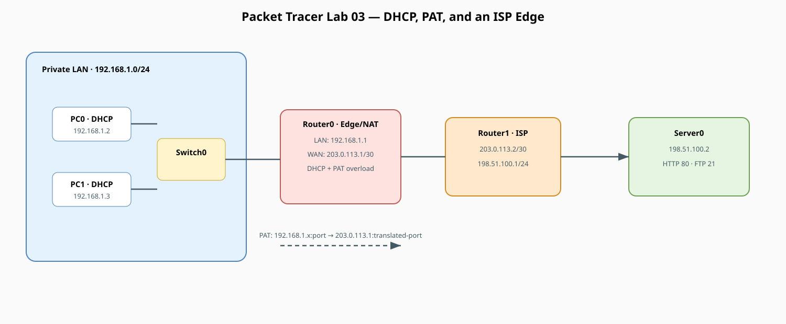

# Two-Router NAT & DHCP Lab — Real-World ISP Architecture

!!! info "Theory prerequisites"
    Read [Private IPs, NAT & PAT](../../theory/05-private-ip-nat.md), [Subnetting & DHCP](../../theory/06-subnetting-dhcp.md), and [Static Routing, OSPF & BGP](../../theory/08-routing-protocols.md). Return to the [Lab-Aligned Learning Path](../lab-theory-map.md) after verification.

This lab builds a complete end-to-end network modeling a private enterprise or home LAN connected to a public ISP and
cloud server. It integrates **DHCP**, **Default Routing**, and **NAT/PAT (Port Address Translation)**.

In this design, **Router0** operates as the boundary router (translating internal private IP space to a public WAN IP),
while **Router1** acts as the upstream ISP router hosting a public HTTP/FTP server. Because NAT hides the private 
`192.168.1.0/24` network, Router1 requires no return routes for private IP space.

## Topology




<details>
<summary>Detailed text topology and NAT packet rewrite</summary>

```text
===============================================================================================================================================
TWO-ROUTER END-TO-END NETWORK TOPOLOGY
===============================================================================================================================================

PRIVATE ENTERPRISE / HOME LAN                       PUBLIC WAN / ISP LINK                       PUBLIC SERVER FARM / CLOUD LAN
Subnet: 192.168.1.0/24                         Subnet: 203.0.113.0/30                           Subnet: 198.51.100.0/24
┌──────────────────────────────────────┐       ┌─────────────────────────────────┐       ┌──────────────────────────────────────────────┐
│                                      │       │                                 │       │                                              │
│   ┌───────────────────────┐          │       │                                 │       │                                              │
│   │         PC0           │          │       │                                 │       │                                              │
│   │ IP: 192.168.1.2 (DHCP)│──Fa0──┐  │       │                                 │       │                                              │
│   │ GW: 192.168.1.1       │       │  │       │                                 │       │                                              │
│   └───────────────────────┘       │  │       │                                 │       │                                              │
│                                   ▼  │       │                                 │       │                                              │
│                              ┌─────────┐     │                                 │       │                                              │
│                              │ Switch0 │Fa0/3│                                 │       │                                              │
│                              │  (2960) │─────┼───┐                             │       │                                              │
│                              └─────────┘     │   │                             │       │                                              │
│                                   ▲  │       │   │                             │       │                                              │
│   ┌───────────────────────┐       │  │       │   ▼                             │       │                                              │
│   │         PC1           │       │  │       │ Gig0/0                          │       │                                              │
│   │ IP: 192.168.1.3 (DHCP)│──Fa0──┘  │       │ ┌─────────────────────────┐     │       │     ┌─────────────────────────┐              │
│   │ GW: 192.168.1.1       │          │       │ │         Router0         │     │       │     │         Router1         │              │
│   └───────────────────────┘          │       │ │      (Edge / NAT)       │     │       │     │      (ISP Gateway)      │              │
│                                      │       │ │                         │     │       │     │                         │              │
│                                      │       │ │  IP: 192.168.1.1/24     │     │       │     │  IP: 203.0.113.2/30     │              │
│                                      │       │ │  Role: LAN Gateway      │     │       │     │  Role: WAN Ingress      │              │
│                                      │       │ │  DHCP: 192.168.1.0/24   │     │       │     │                         │              │
│                                      │       │ │  NAT:  ip nat inside    │     │       │     │                         │              │
│                                      │       │ └────────────┬────────────┘     │       │     └────────────┬────────────┘              │
│                                      │       │              │ Gig0/1           │       │       Gig0/0     │                           │
│                                      │       │              │ 203.0.113.1/30   │       │ 203.0.113.2/30   │                           │
│                                      │       │              │ (ip nat outside) │       │                  │                           │
│                                      │       │              └──────────────────┼───────┼──────────────────┘                           │
│                                      │       │                     Point-to-Point Link (/30)      │                           │
│                                      │       │                                 │                  │ Gig0/1                    │
│                                      │       │                                 │                  │ 198.51.100.1/24           │
│                                      │       │                                 │                  ▼ (Default Gateway)         │
│                                      │       │                                 │             ┌─────────────────────────┐      │
│                                      │       │                                 │             │         Server0         │      │
│                                      │       │                                 │             │   (HTTP & FTP Services) │      │
│                                      │       │                                 │             │                         │      │
│                                      │       │                                 │             │ IP: 198.51.100.2/24     │      │
│                                      │       │                                 │             │ GW: 198.51.100.1        │      │
│                                      │       │                                 │             │ Mask: 255.255.255.0     │      │
│                                      │       │                                 │             └─────────────────────────┘      │
└──────────────────────────────────────┘       └─────────────────────────────────┘       └──────────────────────────────────────────────┘

-----------------------------------------------------------------------------------------------------------------------------------------------
                                                          TRAFFIC FLOW & NAT BEHAVIOR
-----------------------------------------------------------------------------------------------------------------------------------------------

1. PC0 initiates HTTP request:       [ Source: 192.168.1.2:1050 ]   ──────►   [ Dest: 198.51.100.2:80 ]
2. Router0 translates via PAT:       [ Source: 203.0.113.1:2001 ]   ──────►   [ Dest: 198.51.100.2:80 ]
3. Server0 replies to Public WAN:    [ Source: 198.51.100.2:80  ]   ──────►   [ Dest: 203.0.113.1:2001 ]
4. Router0 translates back to PC0:   [ Source: 198.51.100.2:80  ]   ──────►   [ Dest: 192.168.1.2:1050 ]

===============================================================================================================================================
```

</details>

## Addressing Plan

| Device | Interface | IP Address | Subnet Mask | Default Gateway | Role / Notes |
|---|---|---|---|---|---|
| **Router0** | `Gig0/0` | `192.168.1.1` | `255.255.255.0` | — | LAN Default Gateway (`ip nat inside`) |
| **Router0** | `Gig0/1` | `203.0.113.1` | `255.255.255.252` | — | WAN Public IP (`ip nat outside`) |
| **Router1** | `Gig0/0` | `203.0.113.2` | `255.255.255.252` | — | ISP WAN Port |
| **Router1** | `Gig0/1` | `198.51.100.1` | `255.255.255.0` | — | Public Server Gateway |
| **Server0** | `Fa0` | `198.51.100.2` | `255.255.255.0` | `198.51.100.1` | Public HTTP & FTP Server |
| **PC0** | `Fa0` | *via DHCP* | *via DHCP* | `192.168.1.1` | LAN Client (DHCP lease: `192.168.1.2`) |
| **PC1** | `Fa0` | *via DHCP* | *via DHCP* | `192.168.1.1` | LAN Client (DHCP lease: `192.168.1.3`) |

## 1. Place Devices
* 2x Generic PC (`PC0`, `PC1`)
* 1x Switch (`2960-24TT`: `Switch0`)
* 2x Router (`1941`: `Router0`, `Router1`)
* 1x Server (`Server0`)

## 2. Cable Devices (Copper Straight-Through)
* `PC0` (`FastEthernet0`) <—> `Switch0` (`FastEthernet0/1`)
* `PC1` (`FastEthernet0`) <—> `Switch0` (`FastEthernet0/2`)
* `Switch0` (`FastEthernet0/3`) <—> `Router0` (`GigabitEthernet0/0`)
* `Router0` (`GigabitEthernet0/1`) <—> `Router1` (`GigabitEthernet0/0`)
* `Router1` (`GigabitEthernet0/1`) <—> `Server0` (`FastEthernet0`)

## 3. Router0 Configuration (LAN, DHCP, NAT, Default Route)

Open the CLI on **Router0** and paste the following commands:

```text
enable
configure terminal
hostname Router0

! 1. Configure LAN Interface (Inside NAT)
interface GigabitEthernet0/0
 description LAN Interface
 ip address 192.168.1.1 255.255.255.0
 ip nat inside
 no shutdown
exit

! 2. Configure WAN Interface (Outside NAT)
interface GigabitEthernet0/1
 description WAN Interface to ISP
 ip address 203.0.113.1 255.255.255.252
 ip nat outside
 no shutdown
exit

! 3. Configure DHCP Pool for LAN Clients
ip dhcp excluded-address 192.168.1.1
ip dhcp pool LANPOOL
 network 192.168.1.0 255.255.255.0
 default-router 192.168.1.1
 dns-server 8.8.8.8
exit

! 4. Configure NAT Overload (PAT)
access-list 1 permit 192.168.1.0 0.0.0.255
ip nat inside source list 1 interface GigabitEthernet0/1 overload

! 5. Default Route pointing to ISP (Router1)
ip route 0.0.0.0 0.0.0.0 203.0.113.2

end
write memory
```

## 4. Router1 Configuration (ISP Router)

Open the CLI on **Router1** and paste the following commands:

```text
enable
configure terminal
hostname Router1

! 1. Configure WAN Interface to Router0
interface GigabitEthernet0/0
 description WAN to Router0
 ip address 203.0.113.2 255.255.255.252
 no shutdown
exit

! 2. Configure Public Server LAN Interface
interface GigabitEthernet0/1
 description Server Farm Interface
 ip address 198.51.100.1 255.255.255.0
 no shutdown
exit

end
write memory
```

*Note on ISP Routing: Notice that Router1 has NO static route for `192.168.1.0/24`. Because Router0 translates all outbound LAN traffic to its public IP `203.0.113.1`, Router1 only ever sees traffic from `203.0.113.1` (which is directly connected on its `Gig0/0` interface).*

## 5. Server0 Configuration
Open **Server0 > Desktop > IP Configuration**:
* **IP Configuration:** Static
* **IP Address:** `198.51.100.2`
* **Subnet Mask:** `255.255.255.0`
* **Default Gateway:** `198.51.100.1`

Under **Config > Services**:
* **HTTP:** Toggle **On**.
* **FTP:** Toggle **On**, add user `cisco` / password `cisco` with all permissions checked.

## 6. PC0 and PC1 Configuration
Open **PC0** and **PC1** > **Desktop > IP Configuration**:
* Select **DHCP**.
* Verify that each PC successfully receives an IP address (`192.168.1.2` and `192.168.1.3`), Subnet Mask (`255.255.255.0`), and Default Gateway (`192.168.1.1`).

## 7. Verification and Testing

### A. End-to-End Ping Test
From **PC0** command prompt:
```text
ping 198.51.100.2
```
*The first packet may time out during ARP resolution; subsequent replies will succeed.*

### B. Inspect NAT Translations in Real Time
On **Router0 CLI**, run:
```text
show ip nat translations
```
You will see active translation entries mapping internal private sockets to external public sockets:
```text
Pro  Inside global         Inside local          Outside local         Outside global
icmp 203.0.113.1:1         192.168.1.2:1         198.51.100.2:1        198.51.100.2:1
```

### C. Web and FTP Services Test
* From **PC0** or **PC1** browser, navigate to: `http://198.51.100.2`
* From **PC0** or **PC1** command prompt, connect to FTP:
  ```text
  ftp 198.51.100.2
  ```

### D. Verify DHCP Leases
On **Router0 CLI**, run:
```text
show ip dhcp binding
```
Confirm the leased IP addresses match the MAC addresses of PC0 and PC1.

## 8. What to Observe and Key Concepts

| Test / Command | Key Learning Concept |
|---|---|
| `show ip nat translations` on Router0 | Demonstrates **PAT (Port Address Translation)** — multiple private IPs share a single public IP (`203.0.113.1`) distinguished by unique port numbers. |
| Why Router1 doesn't need a route to `192.168.1.0/24` | Proves how NAT provides topology hiding and conserves public routing table entries on the internet/ISP side. |
| Packet Tracer Simulation Mode (Inspection) | Track the packet across hops: on the LAN side, source IP is `192.168.1.2`. After passing Router0, the source IP becomes `203.0.113.1`. |
| `show ip dhcp binding` on Router0 | Demonstrates the DORA process (Discover, Offer, Request, Acknowledge) where hosts dynamically receive IP configuration upon boot. |


## What to Observe (maps back to lecture concepts)

| Test                                   | Concept                                    |
|-----------------------------------------|---------------------------------------------|
| Ping PC0 -> PC1                         | Switch forwards by MAC table, same subnet, no router hop |
| Ping PC0 -> Server0 (198.51.100.2)      | Packet traverses Switch -> Router0 -> Router1 -> Server |
| `show ip nat translations` after above  | Private IP:port mapped to public IP:port (PAT/overload) |
| Simulation Mode, click packet envelope  | Inspect header: source/dest IP, TTL decrementing per hop |
| `show ip dhcp binding`                  | DHCP lease assignment (IP + MAC + lease time) |
| `show ip route`                         | Routing table decisions by destination IP |
