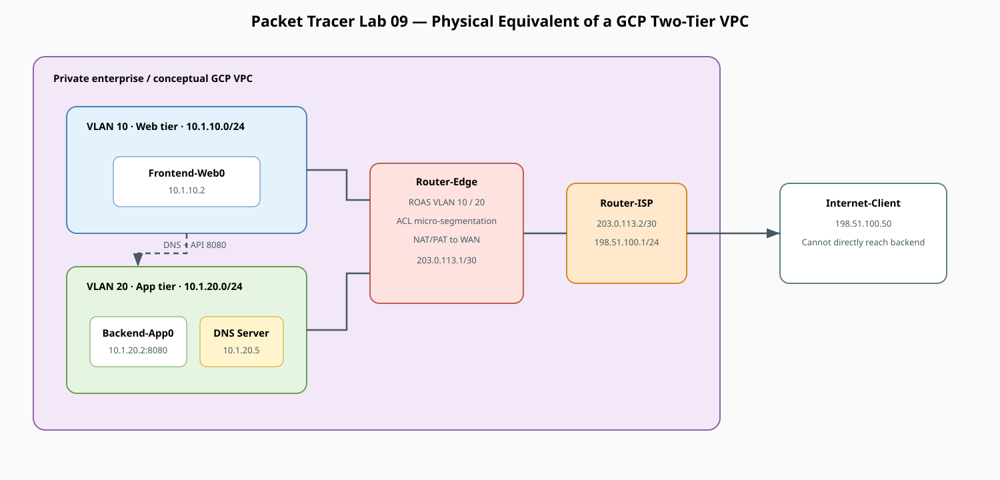

# Packet Tracer Lab: GCP 2-Tier Architecture Equivalent

!!! info "Theory prerequisites"
    Read [VLANs](../../theory/07-vlans.md), [Firewalls](../../theory/13-firewalls.md), and [Cloud & Hybrid Networking](../../theory/15-cloud-hybrid-networking.md). Return to the [Lab-Aligned Learning Path](../lab-theory-map.md) after verification.

This lab builds the exact physical equivalent of the **GCP 2-Tier Terraform architecture**. You will model:

* **Web Subnet (`10.1.10.0/24`):** Public-facing tier hosting `Frontend-Web0`.
* **App Subnet (`10.1.20.0/24`):** Isolated private backend hosting `Backend-App0` and private `DNS-Server0`.
* **GCP Cloud NAT Equivalent:** `Router-Edge` translating private App Subnet traffic to access the outside WAN.
* **GCP Firewall Rules Equivalent:** Cisco Extended Access Control Lists (ACLs) enforcing micro-segmentation (allowing Web → App on port 8080 while blocking direct outside access to the backend).

## Topology




## Direct Concept Mapping: GCP vs. Packet Tracer

| GCP Cloud Component (from Terraform) | Packet Tracer Physical Equivalent | Role in Network |
|---|---|---|
| `google_compute_subnetwork.web_subnet` | VLAN 10 (`10.1.10.0/24`) on `Gig0/0.10` | Public-facing subnet. |
| `google_compute_subnetwork.app_subnet` | VLAN 20 (`10.1.20.0/24`) on `Gig0/0.20` | Isolated private backend subnet. |
| `google_compute_router_nat` | `ip nat inside source list 20 ... overload` | Translates backend private IPs to public WAN IP. |
| `google_compute_firewall` (allow-web-to-app) | Cisco Extended ACL `101` on `Gig0/0.20` | Permits Web → App on Port 8080 and DNS on Port 53; denies rest. |
| `google_dns_managed_zone` (Private Zone) | `DNS-Server0` (`10.1.20.5`) with A-Record | Resolves `api.corp.internal` → `10.1.20.2`. |

## Addressing Plan

| Device | Interface | IP Address | Subnet Mask | Default Gateway | DNS Server | Role |
|---|---|---|---|---|---|---|
| **Router-Edge** | `Gig0/0.10` | `10.1.10.1` | `255.255.255.0` | — | — | Web Subnet Gateway (VLAN 10) |
| **Router-Edge** | `Gig0/0.20` | `10.1.20.1` | `255.255.255.0` | — | — | App Subnet Gateway (VLAN 20) |
| **Router-Edge** | `Gig0/1` | `203.0.113.1` | `255.255.255.252`| — | — | Public WAN Interface |
| **Router-ISP** | `Gig0/0` | `203.0.113.2` | `255.255.255.252`| — | — | ISP Gateway |
| **Router-ISP** | `Gig0/1` | `198.51.100.1` | `255.255.255.0` | — | — | Internet Subnet Gateway |
| **Frontend-Web0**| `Fa0` | `10.1.10.2` | `255.255.255.0` | `10.1.10.1` | `10.1.20.5` | Public HTTP Web Server |
| **Backend-App0** | `Fa0` | `10.1.20.2` | `255.255.255.0` | `10.1.20.1` | `10.1.20.5` | Private Backend API (Port 8080) |
| **DNS-Server0** | `Fa0` | `10.1.20.5` | `255.255.255.0` | `10.1.20.1` | `127.0.0.1` | Internal Private DNS Server |
| **Internet-Client**|`Fa0` | `198.51.100.50`| `255.255.255.0` | `198.51.100.1` | — | Outside Public User |

## 1. Place and Cable Devices

### Devices Required
* 2x Router (`1941`: `Router-Edge`, `Router-ISP`)
* 3x Switch (`2960-24TT`: `Switch-Web`, `Switch-App`, `Switch-ISP`)
* 3x Generic Server (`Frontend-Web0`, `Backend-App0`, `DNS-Server0`)
* 1x Generic PC (`Internet-Client`)

### Cabling (Copper Straight-Through)
* `Frontend-Web0` <—> `Switch-Web` (`Fa0/1`)
* `Switch-Web` (`Fa0/24`) <—> `Router-Edge` (`Gig0/0`)
* `Backend-App0` <—> `Switch-App` (`Fa0/1`)
* `DNS-Server0` <—> `Switch-App` (`Fa0/2`)
* `Switch-App` (`Fa0/24`) <—> `Switch-Web` (`Fa0/23`) *(Carries VLAN trunking)*
* `Router-Edge` (`Gig0/1`) <—> `Router-ISP` (`Gig0/0`)
* `Router-ISP` (`Gig0/1`) <—> `Switch-ISP` (`Fa0/24`)
* `Switch-ISP` (`Fa0/1`) <—> `Internet-Client`

## 2. Switch Configuration (VLANs and 802.1Q Trunking)

### Switch-Web Configuration
```text
enable
configure terminal
hostname Switch-Web

vlan 10
 name Web-Tier
vlan 20
 name App-Tier
exit

! Access port for Frontend-Web0
interface FastEthernet0/1
 switchport mode access
 switchport access vlan 10
 no shutdown
exit

! Trunk port to Switch-App
interface FastEthernet0/23
 switchport mode trunk
 no shutdown
exit

! Trunk port up to Router-Edge
interface FastEthernet0/24
 switchport mode trunk
 no shutdown
exit
```

### Switch-App Configuration
```text
enable
configure terminal
hostname Switch-App

vlan 10
 name Web-Tier
vlan 20
 name App-Tier
exit

! Access ports for Backend-App0 and DNS-Server0
interface FastEthernet0/1
 switchport mode access
 switchport access vlan 20
 no shutdown
exit

interface FastEthernet0/2
 switchport mode access
 switchport access vlan 20
 no shutdown
exit

! Trunk port to Switch-Web
interface FastEthernet0/24
 switchport mode trunk
 no shutdown
exit
```

## 3. Router-Edge Configuration (VLANs, NAT, Firewall ACLs)

Open **Router-Edge CLI**:

```text
enable
configure terminal
hostname Router-Edge

! 1. Sub-interfaces for Web and App Subnets (Router-on-a-Stick)
interface GigabitEthernet0/0
 no shutdown
exit

interface GigabitEthernet0/0.10
 description Web Tier Gateway
 encapsulation dot1Q 10
 ip address 10.1.10.1 255.255.255.0
 ip nat inside
exit

interface GigabitEthernet0/0.20
 description App Tier Gateway
 encapsulation dot1Q 20
 ip address 10.1.20.1 255.255.255.0
 ip nat inside
exit

! 2. Public WAN Interface
interface GigabitEthernet0/1
 description WAN to ISP
 ip address 203.0.113.1 255.255.255.252
 ip nat outside
 no shutdown
exit

! 3. Default Route to ISP
ip route 0.0.0.0 0.0.0.0 203.0.113.2

! 4. NAT / PAT Overload (GCP Cloud NAT equivalent)
access-list 1 permit 10.1.10.0 0.0.0.255
access-list 1 permit 10.1.20.0 0.0.0.255
ip nat inside source list 1 interface GigabitEthernet0/1 overload

! 5. Static Port Forwarding (Expose Web Server to Internet on Port 80)
ip nat inside source static tcp 10.1.10.2 80 203.0.113.1 80

! 6. Firewall Rules (GCP Firewall equivalent)
! Allow Web Tier to reach App Tier (Port 8080) and DNS Server (Port 53)
ip access-list extended APP_TIER_FIREWALL
 permit tcp 10.1.10.0 0.0.0.255 10.1.20.0 0.0.0.255 eq 8080
 permit udp 10.1.10.0 0.0.0.255 10.1.20.0 0.0.0.255 eq 53
 permit icmp 10.1.10.0 0.0.0.255 10.1.20.0 0.0.0.255
 deny ip any 10.1.20.0 0.0.0.255
 permit ip any any
exit

! Apply firewall to traffic entering the App Subnet
interface GigabitEthernet0/0.20
 ip access-group APP_TIER_FIREWALL out
exit

end
write memory
```

## 4. Router-ISP Configuration

Open **Router-ISP CLI**:

```text
enable
configure terminal
hostname Router-ISP

interface GigabitEthernet0/0
 description WAN to Router-Edge
 ip address 203.0.113.2 255.255.255.252
 no shutdown
exit

interface GigabitEthernet0/1
 description Public Internet Users Subnet
 ip address 198.51.100.1 255.255.255.0
 no shutdown
exit

end
write memory
```

## 5. Server Configurations

### A. DNS-Server0 (`10.1.20.5`)
* **IP Configuration:** Static IP `10.1.20.5`, Mask `255.255.255.0`, Gateway `10.1.20.1`, DNS `127.0.0.1`.
* **Services > DNS:** Toggle **On**.
  * Add A-Record: `api.corp.internal` → `10.1.20.2`.

### B. Backend-App0 (`10.1.20.2`)
* **IP Configuration:** Static IP `10.1.20.2`, Mask `255.255.255.0`, Gateway `10.1.20.1`, DNS `10.1.20.5`.
* **Services > HTTP:** Toggle **On**. Edit `index.html` to say: `<h1>Backend API Response: Database Connected</h1>`.

### C. Frontend-Web0 (`10.1.10.2`)
* **IP Configuration:** Static IP `10.1.10.2`, Mask `255.255.255.0`, Gateway `10.1.10.1`, DNS `10.1.20.5`.
* **Services > HTTP:** Toggle **On**. Edit `index.html` to say: `<h1>Welcome to Frontend Web Portal</h1>`.

### D. Internet-Client (`198.51.100.50`)
* **IP Configuration:** Static IP `198.51.100.50`, Mask `255.255.255.0`, Gateway `198.51.100.1`.

## 6. Hands-On Verification and Testing

### Test 1: Internal Micro-Service Communication (Web → App via DNS)
1. Open **Frontend-Web0 > Desktop > Command Prompt**.
2. Run `nslookup api.corp.internal` to confirm DNS resolution to `10.1.20.2`.
3. Open **Web Browser** on `Frontend-Web0` and enter:
   ```text
   http://api.corp.internal
   ```
   *Result:* Web server successfully fetches data from the backend application tier.

### Test 2: Outside Public Ingress (Internet Client → Web Server)
1. Open **Internet-Client > Web Browser**.
2. Navigate to the router's public IP:
   ```text
   http://203.0.113.1
   ```
   *Result:* The client sees `<h1>Welcome to Frontend Web Portal</h1>` via Port Forwarding.

### Test 3: Firewall Enforcement (Security Isolation)
1. From **Internet-Client**, attempt to ping the backend server:
   ```text
   ping 10.1.20.2
   ```
   *Result:* Request timed out / Destination unreachable.
2. From **Internet-Client**, attempt to browse directly to `http://10.1.20.2`.
   *Result:* Blocked by `APP_TIER_FIREWALL` ACL. The backend is completely shielded from public exposure.

### Test 4: Outbound Cloud NAT Verification
1. From **Backend-App0**, ping the public ISP gateway:
   ```text
   ping 203.0.113.2
   ```
2. On **Router-Edge CLI**, run:
   ```text
   show ip nat translations
   ```
   *Result:* You will see `10.1.20.2` translated to `203.0.113.1`, proving the private backend can initiate outbound connections (e.g. for software patches) through NAT overload.
