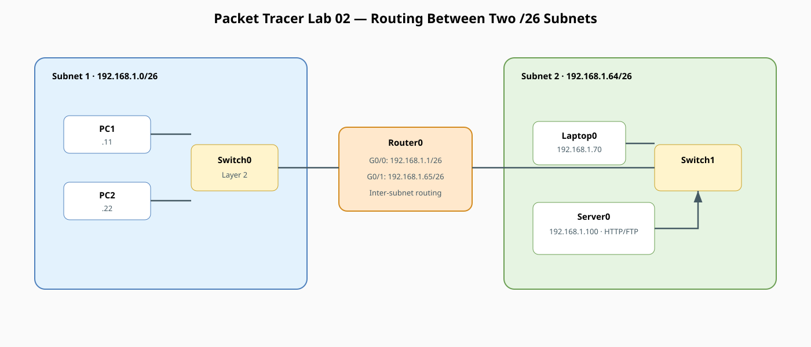
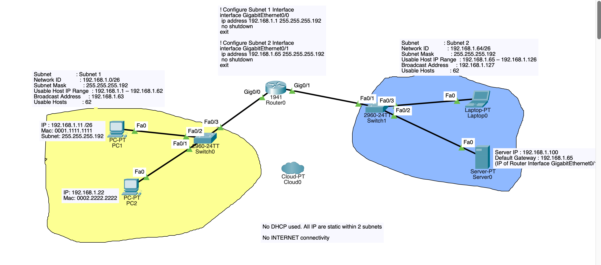

# Router-in-the-middle FTP/HTTP lab (Packet Tracer)

!!! info "Theory prerequisites"
    Read [Packets & IP Addressing](../../02-packets-ip-addressing.md), [Switches vs Routers](../../04-switches-routers.md), and [Subnetting & DHCP](../../06-subnetting-dhcp.md). Return to the [Lab-Aligned Learning Path](../lab-theory-map.md) after verification.

This lab builds directly on the router-in-the-middle architecture by implementing **VLSM / Subnetting (`/26` with mask `255.255.255.192`)** across two separate broadcast domains.

The server now lives on a *different* subnet, reached through a
router. This is the smallest possible step up that actually requires
routing (no NAT yet — that's a separate concept).

All IP addresses are statically assigned without DHCP or external internet connectivity.

## Topology



!!! tip "Editable source"
    Edit [`lab02-router-subnets.drawio`](../diagrams/lab02-router-subnets.drawio) and export it as SVG after changes.

## Addressing Plan

* **Subnet 1 Network:** `192.168.1.0/26` (Usable: `192.168.1.1` – `192.168.1.62`, Mask: `255.255.255.192`, Broadcast: `192.168.1.63`)
* **Subnet 2 Network:** `192.168.1.64/26` (Usable: `192.168.1.65` – `192.168.1.126`, Mask: `255.255.255.192`, Broadcast: `192.168.1.127`)

| Device | Interface | IP Address | Subnet Mask | Default Gateway | Role / Notes |
|---|---|---|---|---|---|
| **Router0** | `Gig0/0` | `192.168.1.1` | `255.255.255.192` | — | Subnet 1 Default Gateway |
| **Router0** | `Gig0/1` | `192.168.1.65` | `255.255.255.192` | — | Subnet 2 Default Gateway |
| **PC1** | `Fa0` | `192.168.1.11` | `255.255.255.192` | `192.168.1.1` | Subnet 1 Client (MAC: `0001.1111.1111`) |
| **PC2** | `Fa0` | `192.168.1.22` | `255.255.255.192` | `192.168.1.1` | Subnet 1 Client (MAC: `0002.2222.2222`) |
| **Server0** | `Fa0` | `192.168.1.100` | `255.255.255.192` | `192.168.1.65` | Subnet 2 HTTP / FTP Server |
| **Laptop0** | `Fa0` | `192.168.1.70` | `255.255.255.192` | `192.168.1.65` | Subnet 2 Client |

## 1. Place Devices
* 2x Generic PC (`PC1`, `PC2`)
* 1x Laptop (`Laptop0`)
* 2x Switch (`2960-24TT`: `Switch0`, `Switch1`)
* 1x Router (`1941`: `Router0`)
* 1x Server (`Server0`)

## 2. Cable Devices (Copper Straight-Through)

### Subnet 1 Connections
* `PC1` (`FastEthernet0`) <—> `Switch0` (`FastEthernet0/2`)
* `PC2` (`FastEthernet0`) <—> `Switch0` (`FastEthernet0/1`)
* `Switch0` (`FastEthernet0/3`) <—> `Router0` (`GigabitEthernet0/0`)

### Subnet 2 Connections
* `Router0` (`GigabitEthernet0/1`) <—> `Switch1` (`FastEthernet0/1`)
* `Switch1` (`FastEthernet0/2`) <—> `Server0` (`FastEthernet0`)
* `Switch1` (`FastEthernet0/3`) <—> `Laptop0` (`FastEthernet0`)

## 3. Router0 Configuration

Open the CLI on **Router0** and execute the following configuration:

```text
enable
configure terminal
hostname Router0

! Subnet 1 Gateway Configuration
interface GigabitEthernet0/0
 ip address 192.168.1.1 255.255.255.192
 no shutdown
exit

! Subnet 2 Gateway Configuration
interface GigabitEthernet0/1
 ip address 192.168.1.65 255.255.255.192
 no shutdown
exit

end
write memory
```

*Note: No dynamic routing protocol or static routes are needed because Router0 has directly connected interfaces in both Subnet 1 and Subnet 2.*

## 4. Host Configuration (Static IP Setup)

Open each end device and configure static IP settings under **Desktop > IP Configuration**:

### Subnet 1 Hosts
* **PC1:**
  * IP Address: `192.168.1.11`
  * Subnet Mask: `255.255.255.192`
  * Default Gateway: `192.168.1.1`
* **PC2:**
  * IP Address: `192.168.1.22`
  * Subnet Mask: `255.255.255.192`
  * Default Gateway: `192.168.1.1`

### Subnet 2 Hosts
* **Server0:**
  * IP Address: `192.168.1.100`
  * Subnet Mask: `255.255.255.192`
  * Default Gateway: `192.168.1.65`
* **Laptop0:**
  * IP Address: `192.168.1.70`
  * Subnet Mask: `255.255.255.192`
  * Default Gateway: `192.168.1.65`

## 5. Enable HTTP & FTP Services on Server0

Navigate to **Server0 > Config tab > Services**:
* **HTTP:** Ensure HTTP and HTTPS services are toggled **On**.
* **FTP:** Ensure FTP service is toggled **On**. Under user accounts, add username `cisco` / password `cisco` with all permissions (`Read`, `Write`, `Delete`, `Rename`, `List`) checked.

## 6. Verification and Testing

From **PC1** or **PC2** in Subnet 1:

### A. ICMP Ping Test
Open **Desktop > Command Prompt** and test connectivity across subnets:
```text
ping 192.168.1.100
```
*(The first ping packet may time out while ARP resolves across hops; subsequent pings will succeed with TTL decremented to 127/254).*

### B. HTTP Web Browser Test
Open **Desktop > Web Browser** and navigate to:
```text
http://192.168.1.100
```
You should see the default Cisco Packet Tracer web page.

### C. FTP Client Test
Open **Desktop > Command Prompt** and run:
```text
ftp 192.168.1.100
```
Enter username `cisco` and password `cisco`. Once authenticated, verify file access:
```text
dir
get index.html
quit
```

## 7. Key Observations & Troubleshooting

| Action / Verification | Concept Demonstrated |
|---|---|
| `show ip route` on Router0 | Displays two directly connected routes (`192.168.1.0/26` on `Gig0/0` and `192.168.1.64/26` on `Gig0/1`). |
| Why `255.255.255.192` is required | Prevents subnet overlap errors on Router0 and defines two distinct broadcast domains of 62 usable IPs each. |
| Removing Default Gateway on PC1 | Cross-subnet ping fails because PC1 cannot determine where to forward non-local traffic without a gateway. |
| Packet Tracer Simulation Mode | Inspect how Ethernet frame MAC addresses change at each L2 hop while source and destination IP addresses remain constant end-to-end. |


## Observe ARP in 1-Router Lab
Take 5 minutes to observe ARP in Packet Tracer using Simulation Mode:

1. In your current lab, switch from Realtime to Simulation mode (bottom right icon).
2. Ping from PC1 (192.168.1.11) to Server0 (192.168.1.100).
3. Click the Play / Forward button step-by-step:
   - Notice that PC1 creates an ICMP packet, but it cannot send it yet because it doesn't know the MAC address of its Gateway (192.168.1.1).
   - PC1 broadcasts an ARP request (Who has 192.168.1.1?).
   - Once Router0 replies with its MAC address, PC1 sends the ICMP ping.
4. On PC1's command prompt, type:
   ```
   arp -a
   ```
You will see the Gateway IP mapped to Router0’s physical MAC address.