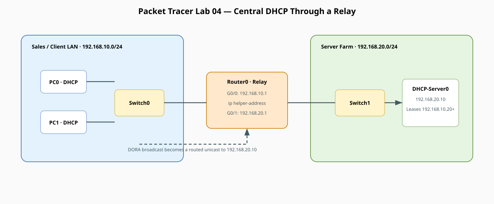
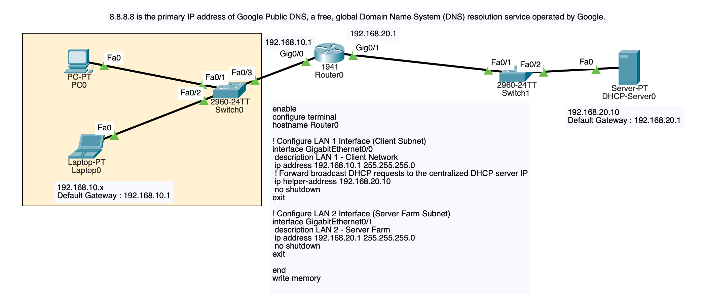
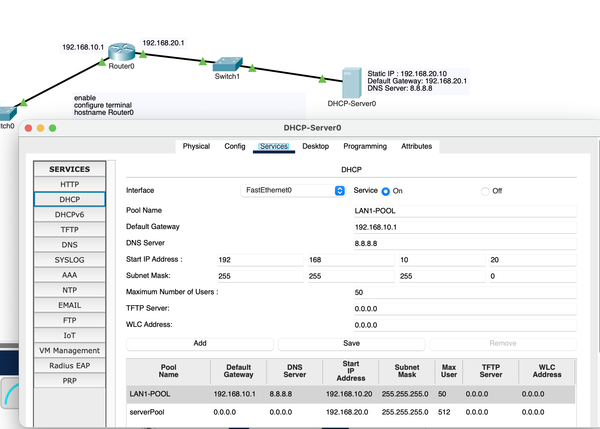

# Dedicated DHCP & DHCP Relay Agent Lab (Packet Tracer)

!!! info "Theory prerequisites"
    Read [Switches vs Routers](../../04-switches-routers.md) and [Subnetting & DHCP](../../06-subnetting-dhcp.md). Return to the [Lab-Aligned Learning Path](../lab-theory-map.md) after verification.

This lab is designed to take you from DHCP fundamentals to advanced enterprise implementations. You will build and observe:

* **Part 1: Basic Router-Based DHCP Server** (Local LAN pool with exclusions and options)
* **Part 2: The DORA Process Deep-Dive** (Discover, Offer, Request, Acknowledge in Packet Tracer Simulation Mode)
* **Part 3: Enterprise DHCP Relay Agent (`ip helper-address`)** (Centralized DHCP server providing leases to a remote subnet across a router)

## Topology



!!! tip "Editable source"
    Edit [`lab04-dhcp-relay.drawio`](../diagrams/lab04-dhcp-relay.drawio) and export it as SVG after changes.



## Addressing Plan

| Device | Interface | IP Address | Subnet Mask | Default Gateway | Role |
|---|---|---|---|---|---|
| **Router0** | `Gig0/0` | `192.168.10.1` | `255.255.255.0` | — | LAN 1 Gateway (Relay Agent via `ip helper-address`) |
| **Router0** | `Gig0/1` | `192.168.20.1` | `255.255.255.0` | — | LAN 2 Gateway (Server Farm) |
| **DHCP-Server0** | `Fa0` | `192.168.20.10` | `255.255.255.0` | `192.168.20.1` | Centralized Dedicated DHCP Server |
| **PC0** | `Fa0` | *via DHCP* | *via DHCP* | `192.168.10.1` | Client in LAN 1 (Dynamic Lease: `192.168.10.20+`) |
| **PC1** | `Fa0` | *via DHCP* | *via DHCP* | `192.168.10.1` | Client in LAN 1 (Dynamic Lease: `192.168.10.21+`) |

## 1. Place and Cable Devices

### Devices Required
* 2x Generic PC (`PC0`, `PC1`)
* 2x Switch (`2960-24TT`: `Switch0`, `Switch1`)
* 1x Router (`1941`: `Router0`)
* 1x Server (`DHCP-Server0`)

### Cabling Connections (Copper Straight-Through)
* `PC0` (`FastEthernet0`) <—> `Switch0` (`FastEthernet0/1`)
* `PC1` (`FastEthernet0`) <—> `Switch0` (`FastEthernet0/2`)
* `Switch0` (`FastEthernet0/3`) <—> `Router0` (`GigabitEthernet0/0`)
* `Router0` (`GigabitEthernet0/1`) <—> `Switch1` (`FastEthernet0/1`)
* `Switch1` (`FastEthernet0/2`) <—> `DHCP-Server0` (`FastEthernet0`)

## 2. Router0 Configuration

Open **Router0 CLI** and configure the interface IP addresses and the DHCP relay helper:

```text
enable
configure terminal
hostname Router0

! Configure LAN 1 Interface (Client Subnet)
interface GigabitEthernet0/0
 description LAN 1 - Client Network
 ip address 192.168.10.1 255.255.255.0
 ! Forward broadcast DHCP requests to the centralized DHCP server IP
 ip helper-address 192.168.20.10
 no shutdown
exit

! Configure LAN 2 Interface (Server Farm Subnet)
interface GigabitEthernet0/1
 description LAN 2 - Server Farm
 ip address 192.168.20.1 255.255.255.0
 no shutdown
exit

end
write memory
```

## 3. Dedicated DHCP-Server0 Configuration

Open **DHCP-Server0**:

### Step A: Configure Static IP on the Server
Go to **Desktop > IP Configuration**:

* **IP Address:** `192.168.20.10`
* **Subnet Mask:** `255.255.255.0`
* **Default Gateway:** `192.168.20.1`
* **DNS Server:** `8.8.8.8`

### Step B: Configure the DHCP Service for Remote Subnet
Go to **Services tab > DHCP**:

* Service: Toggle **On**
* Pool Name: `LAN1-POOL`
* Default Gateway: `192.168.10.1`
* DNS Server: `8.8.8.8`
* Start IP Address: `192.168.10.20`
* Subnet Mask: `255.255.255.0`
* Maximum number of Users: `50`
* Click **Add** (or **Save**)

*(Optional: You can also keep the default `serverPool` for the local `192.168.20.0/24` subnet if you add servers later).*



## 4. Alternative Implementation: Router as the DHCP Server

If you prefer to run DHCP directly on the Cisco router without a separate server device, configure these commands on Router0 instead of `ip helper-address`:

```text
! Exclude static infrastructure IPs from being assigned
ip dhcp excluded-address 192.168.10.1 192.168.10.19

! Define DHCP Pool for LAN 1
ip dhcp pool POOL-LAN1
 network 192.168.10.0 255.255.255.0
 default-router 192.168.10.1
 dns-server 8.8.8.8
 domain-name company.local
 lease 7
exit
```

## 5. Verification and Testing

### A. Test DHCP on Client PCs
1. Open **PC0 > Desktop > IP Configuration** and click **DHCP**.
2. Verify that `PC0` receives:
   * IP Address: `192.168.10.20`
   * Subnet Mask: `255.255.255.0`
   * Default Gateway: `192.168.10.1`
   * DNS Server: `8.8.8.8`
3. Repeat on **PC1**; it should receive `192.168.10.21`.

### B. Command Prompt Verification
On **PC0 Command Prompt**, test releasing and renewing leases:
```text
ipconfig /all
ipconfig /release
ipconfig /renew
```

### C. Ping Test Across Subnets
From **PC0**, ping the DHCP server in LAN 2:
```text
ping 192.168.20.10
```

## 6. Understanding the DORA Process (Simulation Mode Walkthrough)

Switch Packet Tracer to **Simulation Mode** (Shift + S), set event filters to **DHCP** and **ICMP**, and click `ipconfig /renew` on PC0 to watch each step:

* **1. Discover (D):** PC0 has no IP address, so it broadcasts `255.255.255.255` asking "Is there a DHCP server available?"
* **2. Relay / Forward:** Router0 intercepts the Layer 2 broadcast on `Gig0/0`, wraps it in a unicast packet, and forwards it to `192.168.20.10` via `ip helper-address`.
* **3. Offer (O):** DHCP-Server0 replies with an available IP offer (`192.168.10.20`), default gateway, and lease parameters.
* **4. Request (R):** PC0 formally broadcasts: "I accept the offer of `192.168.10.20` from DHCP-Server0."
* **5. Acknowledge (A):** The DHCP server sends the final ACK confirmation, committing the lease to its database.

## 7. Key Troubleshooting & Observation Matrix

| Issue / Command                     | Cause & Solution                                                                                                                  | Concept Explained                                                                    |
|:------------------------------------|:----------------------------------------------------------------------------------------------------------------------------------|:-------------------------------------------------------------------------------------|
| PC gets `169.254.x.x` (APIPA)       | DHCP request timed out; check `ip helper-address` on Router0 or verify DHCP service is toggled On.                                | **APIPA** is assigned automatically by the OS when DHCP fails.                       |
| `show ip dhcp binding` (on Router)  | Displays all active MAC-to-IP lease assignments.                                                                                  | Confirms which host has claimed which address.                                       |
| `show ip dhcp pool` (on Router)     | Shows total addresses, leased count, and remaining available IPs.                                                                 | Useful for monitoring pool exhaustion.                                               |
| Why `ip helper-address` is required | Routers drop Layer 2 broadcasts by default. The helper converts UDP broadcasts (ports 67/68) into unicast packets across subnets. | **DHCP Relay** enables one central DHCP server to manage hundreds of branch subnets. |
