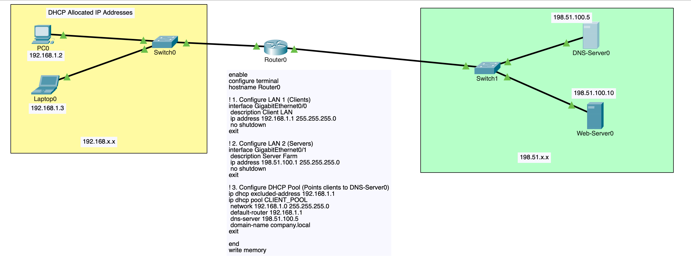
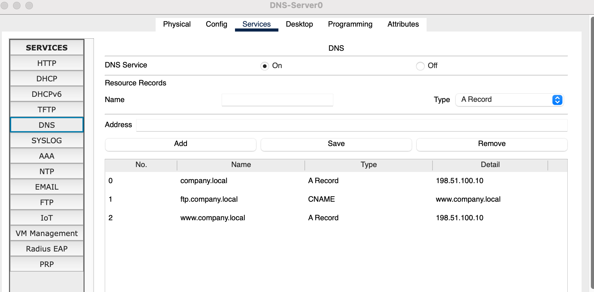

# Dedicated DNS & Name Resolution Lab (Packet Tracer)

This lab introduces **Domain Name System (DNS)** concepts from the ground up. 
You will learn how human-friendly hostnames (such as `www.company.local` and `ftp.company.local`) are resolved into 
IP addresses across different subnets.

You will configure:

* **A Records (Address Records):** Mapping domain names directly to IPv4 addresses.
* **CNAME Records (Canonical Name / Alias):** Aliasing secondary service names to primary domain names.
* **Integrated DHCP + DNS:** Automatically distributing DNS server settings to client PCs.
* **Simulation Mode Packet Tracing:** Watching a DNS UDP query (Port 53) trigger before an HTTP TCP handshake (Port 80).

```
[LAN 1: Clients - 192.168.1.0/24]                      [LAN 2: Server Farm - 198.51.100.0/24]

[PC0]──┐                                               ┌──[DNS-Server0: 198.51.100.5]
       ├──[Switch0]──(Gig0/0)[ Router0 ](Gig0/1)──[Switch1]┤
[PC1]──┘                                               └──[Web-Server0: 198.51.100.10]
```



## Addressing Plan

| Device          | Interface | IP Address      | Subnet Mask     | Default Gateway | DNS Server     | Role                           |
|:----------------|:----------|:----------------|:----------------|:----------------|:---------------|:-------------------------------|
| **Router0**     | `Gig0/0`  | `192.168.1.1`   | `255.255.255.0` | —               | —              | LAN 1 Gateway & DHCP Server    |
| **Router0**     | `Gig0/1`  | `198.51.100.1`  | `255.255.255.0` | —               | —              | LAN 2 Gateway (Server Farm)    |
| **DNS-Server0** | `Fa0`     | `198.51.100.5`  | `255.255.255.0` | `198.51.100.1`  | `127.0.0.1`    | Dedicated DNS Server (Port 53) |
| **Web-Server0** | `Fa0`     | `198.51.100.10` | `255.255.255.0` | `198.51.100.1`  | `198.51.100.5` | HTTP & FTP Server              |
| **PC0**         | `Fa0`     | *via DHCP*      | *via DHCP*      | `192.168.1.1`   | `198.51.100.5` | Client PC (`192.168.1.2`)      |
| **PC1**         | `Fa0`     | *via DHCP*      | *via DHCP*      | `192.168.1.1`   | `198.51.100.5` | Client PC (`192.168.1.3`)      |

## 1. Place and Cable Devices

### Devices Required
* 2x Generic PC (`PC0`, `PC1`)
* 2x Switch (`2960-24TT`: `Switch0`, `Switch1`)
* 1x Router (`1941`: `Router0`)
* 2x Server (`DNS-Server0`, `Web-Server0`)

### Cabling Connections (Copper Straight-Through)
* `PC0` (`FastEthernet0`) <—> `Switch0` (`FastEthernet0/1`)
* `PC1` (`FastEthernet0`) <—> `Switch0` (`FastEthernet0/2`)
* `Switch0` (`FastEthernet0/3`) <—> `Router0` (`GigabitEthernet0/0`)
* `Router0` (`GigabitEthernet0/1`) <—> `Switch1` (`FastEthernet0/1`)
* `Switch1` (`FastEthernet0/2`) <—> `DNS-Server0` (`FastEthernet0`)
* `Switch1` (`FastEthernet0/3`) <—> `Web-Server0` (`FastEthernet0`)

## 2. Router0 Configuration

Open **Router0 CLI** and configure the interfaces and DHCP pool (which includes the DNS server IP address option):

```text
enable
configure terminal
hostname Router0

! 1. Configure LAN 1 (Clients)
interface GigabitEthernet0/0
 description Client LAN
 ip address 192.168.1.1 255.255.255.0
 no shutdown
exit

! 2. Configure LAN 2 (Servers)
interface GigabitEthernet0/1
 description Server Farm
 ip address 198.51.100.1 255.255.255.0
 no shutdown
exit

! 3. Configure DHCP Pool (Points clients to DNS-Server0)
ip dhcp excluded-address 192.168.1.1
ip dhcp pool CLIENT_POOL
 network 192.168.1.0 255.255.255.0
 default-router 192.168.1.1
 dns-server 198.51.100.5
 domain-name company.local
exit

end
write memory
```

## 3. Server Configuration

### Step A: Configure DNS-Server0
1. Open **DNS-Server0 > Desktop > IP Configuration**:
   * IP Address: `198.51.100.5`
   * Subnet Mask: `255.255.255.0`
   * Default Gateway: `198.51.100.1`
   * DNS Server: `127.0.0.1` (or `198.51.100.5`)
2. Go to **Services > DNS**:
   * DNS Service: Toggle **On**
   * **Add 'A Record' (Primary Domain):**
     * Name: `www.company.local`
     * Type: `A Record`
     * Address: `198.51.100.10`
     * Click **Add**
   * **Add 'A Record' (Apex Domain):**
     * Name: `company.local`
     * Type: `A Record`
     * Address: `198.51.100.10`
     * Click **Add**
   * **Add 'CNAME Record' (Alias for FTP):**
     * Name: `ftp.company.local`
     * Type: `CNAME`
     * Host Name: `www.company.local`
     * Click **Add**



### Step B: Configure Web-Server0
1. Open **Web-Server0 > Desktop > IP Configuration**:
   * IP Address: `198.51.100.10`
   * Subnet Mask: `255.255.255.0`
   * Default Gateway: `198.51.100.1`
   * DNS Server: `198.51.100.5`
2. Go to **Services > HTTP**:
   * Toggle **On** for HTTP and HTTPS
   * (Optional) Click `edit` next to `index.html` and change the text to `<h1>Welcome to Company Portal</h1>`
3. Go to **Config > Services > FTP**:
   * Toggle **On**, add user `cisco` / password `cisco` with all permissions checked.

## 4. Client PC Configuration

1. Open **PC0 > Desktop > IP Configuration**:
   * Select **DHCP**.
   * Confirm PC0 receives an IP (`192.168.1.2`), Gateway (`192.168.1.1`), and DNS Server (`198.51.100.5`).
2. Repeat for **PC1**.

## 5. Verification and Testing

### A. NSLOOKUP Name Resolution Test
Open **PC0 > Desktop > Command Prompt** and query the DNS server directly:

```text
nslookup www.company.local
```
*Expected Output:*
```text
Server:  198.51.100.5
Address: 198.51.100.5

Name:    www.company.local
Address: 198.51.100.10
```

Test the CNAME alias:
```text
nslookup ftp.company.local
```
*Expected Output shows `ftp.company.local` aliases to `www.company.local` which resolves to `198.51.100.10`.*

### B. Web Browsing via Domain Name
Open **PC0 > Desktop > Web Browser** and navigate to:
```text
http://www.company.local
```
*(You will reach the Web Server page without ever typing an IP address).*

### C. FTP Access via CNAME
Open **PC0 > Desktop > Command Prompt**:
```text
ftp ftp.company.local
```
Enter username `cisco` / password `cisco` to verify service reachability via domain alias.

## 6. How DNS Works Under the Hood (Simulation Mode)

Switch Packet Tracer to **Simulation Mode** (Shift + S) and filter by **DNS, ICMP, and HTTP**:

1. On **PC0 Web Browser**, enter `http://www.company.local` and press Enter.
2. Step through the packets:
   * **Step 1 (DNS Query):** PC0 encapsulates a DNS query into a **UDP** packet with destination port **53** addressed to `198.51.100.5`.
   * **Step 2 (Routing):** Router0 forwards the UDP packet across subnets from `Gig0/0` to `Gig0/1`.
   * **Step 3 (DNS Response):** DNS-Server0 looks up its database and sends back a DNS Answer: `www.company.local = 198.51.100.10`.
   * **Step 4 (HTTP Connection):** Now that PC0 knows the IP address, it initiates a **TCP 3-way handshake (SYN, SYN-ACK, ACK)** to `198.51.100.10:80` followed by an `HTTP GET` request.

## 7. DNS Key Concept Reference

| Concept / Record | Purpose | Example from Lab |
|---|---|---|
| **A Record** | Maps a domain name (FQDN) to an IPv4 address. | `www.company.local` $
ightarrow$ `198.51.100.10` |
| **CNAME Record** | Creates an alias pointing one name to another canonical name. | `ftp.company.local` $
ightarrow$ `www.company.local` |
| **Port 53 (UDP vs TCP)** | Standard DNS queries use **UDP 53** for low latency; large transfers/zone transfers use **TCP 53**. | PC queries to `198.51.100.5:53` |
| **Hierarchical Resolution** | In production, if a local DNS server cannot resolve an address, it forwards queries up to Root servers, TLD servers, and Authoritative servers. | In this lab, DNS-Server0 is authoritative for `.company.local`. |
