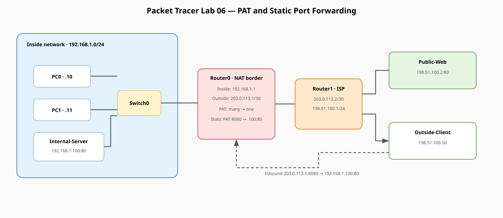
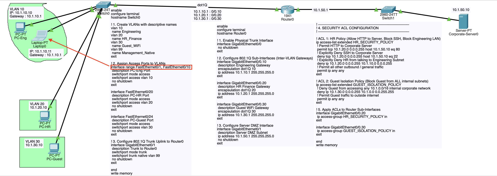

# Comprehensive NAT, PAT & Port Forwarding Lab (Packet Tracer)

!!! info "Theory prerequisites"
    Read [Private IPs, NAT & PAT](../../theory/05-private-ip-nat.md), [TCP vs UDP](../../theory/09-tcp-udp.md), and [Firewalls](../../theory/13-firewalls.md). Return to the [Lab-Aligned Learning Path](../lab-theory-map.md) after verification.

This lab provides an in-depth, hands-on exploration of **Network Address Translation (NAT)** and 
**Port Address Translation (PAT / NAT Overload)**. You will configure and test all three fundamental NAT types used 
in enterprise and service provider networks:

* **1. PAT / NAT Overload (Many-to-One):** Multiple private LAN hosts sharing a single public IP to browse the public internet.
* **2. Static NAT & Port Forwarding (Static PAT):** Publishing an internal private web server (`192.168.1.100:80`) so outside users can access it via the router's public IP (`203.0.113.1:8080`).
* **3. Dynamic NAT (Many-to-Many Pool):** Translating internal hosts to a pool of public IP addresses.

Directly answers your previous question about running multiple backend ports (8080, 8090) behind a single IP (1.2.3.4).

What you will build: Configure Inside Local vs Inside Global IP translation, Port Address Translation (PAT / Overload), and static port forwards on the router perimeter.

## Topology



!!! tip "Editable source"
    Edit [`lab06-nat-pat.drawio`](../diagrams/lab06-nat-pat.drawio) and export it as SVG after changes.



## NAT Terminology Reference

Understanding the 4 Cisco NAT terms is essential for troubleshooting translation tables:

| NAT Term           | Definition                                                                 | Lab Example                        |
|:-------------------|:---------------------------------------------------------------------------|:-----------------------------------|
| **Inside Local**   | The actual private IP address assigned to a host inside the local network. | `192.168.1.10` (PC0)               |
| **Inside Global**  | The public IP address representing inside hosts to the outside world.      | `203.0.113.1` (Router0 WAN IP)     |
| **Outside Local**  | The IP address of an outside host as known to the inside network.          | `198.51.100.2` (Public Web Server) |
| **Outside Global** | The actual public IP address assigned to a host on the outside network.    | `198.51.100.2`                     |

## Corrosponding Terraform

Cisco NAT Term,Cisco Definition,GCP Equivalent Concept,Terraform Resource & Attribute
**Inside Local**,Private IP of internal host,**Internal Private IP** assigned to a VM,google_compute_instance.network_interface[0].network_ip*(drawn from google_compute_subnetwork.ip_cidr_range)*
**Inside Global**,Public IP representing inside hosts to the internet,**Cloud NAT External Egress IP** (or VM access_config 1:1 Public IP),"google_compute_router_nat.nat_ips*(using google_compute_address.type = ""EXTERNAL"")*"
**Outside Local**,Destination IP as seen by inside host,**Target Destination IP** (or Private Service Connect internal endpoint),"Egress destination (e.g., 0.0.0.0/0 via default-internet-gateway)"
**Outside Global**,Actual public IP of external server on the internet,**External Server Public IP**,Remote web server / external API endpoint (e.g. 8.8.8.8 or 198.51.100.2)

## Terraform Code 

```hcl
# =========================================================================
# 1. INSIDE LOCAL: VPC Subnet providing private IPs (e.g. 10.0.1.0/24)
# =========================================================================
resource "google_compute_network" "vpc" {
  name                    = "enterprise-vpc"
  auto_create_subnetworks = false
}

resource "google_compute_subnetwork" "private_subnet" {
  name          = "private-tier-subnet"
  ip_cidr_range = "10.0.1.0/24"          # <-- IP Pool for INSIDE LOCAL
  region        = "us-central1"
  network       = google_compute_network.vpc.id
}

resource "google_compute_instance" "backend_vm" {
  name         = "backend-app-01"
  machine_type = "e2-medium"
  zone         = "us-central1-a"

  network_interface {
    subnetwork = google_compute_subnetwork.private_subnet.id
    # VM gets "Inside Local" IP e.g. 10.0.1.5 (No public IP assigned here)
  }
}

# =========================================================================
# 2. INSIDE GLOBAL: Reserved Public Static IP for Cloud NAT (e.g. 203.0.113.1)
# =========================================================================
resource "google_compute_address" "nat_public_ip" {
  name         = "nat-inside-global-ip"
  address_type = "EXTERNAL"              # <-- Represents INSIDE GLOBAL
  region       = "us-central1"
}

# Cloud Router acts as the perimeter Layer 3 Gateway
resource "google_compute_router" "nat_router" {
  name    = "nat-router"
  region  = "us-central1"
  network = google_compute_network.vpc.id
}

# Cloud NAT translates 10.0.1.x (Inside Local) -> 203.0.113.1 (Inside Global)
resource "google_compute_router_nat" "cloud_nat" {
  name                               = "enterprise-cloud-nat"
  router                             = google_compute_router.nat_router.name
  region                             = "us-central1"
  nat_ip_allocate_option             = "MANUAL_ONLY"
  nat_ips                            = [google_compute_address.nat_public_ip.self_link] # Inside Global IP
  source_subnetwork_ip_ranges_to_nat = "ALL_SUBNETWORKS_ALL_IP_RANGES"
}

# =========================================================================
# 3 & 4. OUTSIDE LOCAL & OUTSIDE GLOBAL: Route to the Public Internet
# =========================================================================
# Reached via the VPC default Internet Gateway (0.0.0.0/0)
resource "google_compute_route" "internet_route" {
  name             = "default-internet-egress"
  dest_range       = "0.0.0.0/0"         # <-- Target Outside Global/Local Range
  network          = google_compute_network.vpc.name
  next_hop_gateway = "default-internet-gateway"
  priority         = 1000
}

```

## Addressing Plan

| Device | Interface | IP Address | Subnet Mask | Default Gateway | Role |
|---|---|---|---|---|---|
| **Router0** | `Gig0/0` | `192.168.1.1` | `255.255.255.0` | — | Inside Interface (`ip nat inside`) |
| **Router0** | `Gig0/1` | `203.0.113.1` | `255.255.255.252` | — | Outside Interface (`ip nat outside`) |
| **Router1** | `Gig0/0` | `203.0.113.2` | `255.255.255.252` | — | ISP WAN Gateway |
| **Router1** | `Gig0/1` | `198.51.100.1` | `255.255.255.0` | — | Public Server Farm Gateway |
| **PC0** | `Fa0` | `192.168.1.10` | `255.255.255.0` | `192.168.1.1` | Inside LAN Client |
| **PC1** | `Fa0` | `192.168.1.11` | `255.255.255.0` | `192.168.1.1` | Inside LAN Client |
| **Internal-Server**| `Fa0` | `192.168.1.100` | `255.255.255.0` | `192.168.1.1` | Inside HTTP Web Server (Port 80) |
| **Public-Web** | `Fa0` | `198.51.100.2` | `255.255.255.0` | `198.51.100.1` | Outside Public HTTP Server |
| **Outside-Client**| `Fa0` | `198.51.100.50` | `255.255.255.0` | `198.51.100.1` | External Public User |

## 1. Place and Cable Devices

### Devices Required
* 3x Generic PC / Laptop (`PC0`, `PC1`, `Outside-Client`)
* 2x Server (`Internal-Server`, `Public-Web`)
* 2x Switch (`2960-24TT`: `Switch0`, `Switch1`)
* 2x Router (`1941`: `Router0`, `Router1`)

### Cabling (Copper Straight-Through)
* `PC0`, `PC1`, `Internal-Server` <—> `Switch0`
* `Switch0` <—> `Router0` (`Gig0/0`)
* `Router0` (`Gig0/1`) <—> `Router1` (`Gig0/0`)
* `Router1` (`Gig0/1`) <—> `Switch1`
* `Switch1` <—> `Public-Web`, `Outside-Client`

## 2. Router0 Configuration (NAT, PAT & Port Forwarding)

Open **Router0 CLI** and apply the following configuration:

```text
enable
configure terminal
hostname Router0

! 1. Assign Interface IPs and Define NAT Boundaries
interface GigabitEthernet0/0
 description Inside Private LAN
 ip address 192.168.1.1 255.255.255.0
 ip nat inside
 no shutdown
exit

interface GigabitEthernet0/1
 description Outside Public WAN
 ip address 203.0.113.1 255.255.255.252
 ip nat outside
 no shutdown
exit

! 2. Default Route out to the ISP (Router1)
ip route 0.0.0.0 0.0.0.0 203.0.113.2

! 3. PAT / NAT Overload for Outbound LAN Traffic
! Define standard ACL identifying private internal subnet
access-list 10 permit 192.168.1.0 0.0.0.255

! Map ACL 10 to public WAN interface with port overload
ip nat inside source list 10 interface GigabitEthernet0/1 overload

! 4. Static NAT / Port Forwarding (Publish Internal Web Server)
! Forward outside public port 8080 on 203.0.113.1 to internal port 80 on 192.168.1.100
ip nat inside source static tcp 192.168.1.100 80 203.0.113.1 8080

end
write memory
```

## 3. Router1 Configuration (ISP Router)

Open **Router1 CLI**:

```text
enable
configure terminal
hostname Router1

interface GigabitEthernet0/0
 description WAN Link to Customer Router0
 ip address 203.0.113.2 255.255.255.252
 no shutdown
exit

interface GigabitEthernet0/1
 description Public Server Farm & Internet Clients
 ip address 198.51.100.1 255.255.255.0
 no shutdown
exit

end
write memory
```

*Note: Router1 represents the Internet / ISP and only knows public IP routes. It has NO route for `192.168.1.0/24`.*

## 4. Host Configurations

### Inside Devices (Subnet `192.168.1.0/24`)

* **PC0:** IP `192.168.1.10`, Mask `255.255.255.0`, Gateway `192.168.1.1`
* **PC1:** IP `192.168.1.11`, Mask `255.255.255.0`, Gateway `192.168.1.1`
* **Internal-Server:** IP `192.168.1.100`, Mask `255.255.255.0`, Gateway `192.168.1.1`
  * Under **Config > Services > HTTP**: Ensure HTTP is **On**. Edit `index.html` to display `<h1>Internal Enterprise Server</h1>`.

### Outside Devices (Subnet `198.51.100.0/24`)

* **Public-Web:** IP `198.51.100.2`, Mask `255.255.255.0`, Gateway `198.51.100.1`
  * Under **Config > Services > HTTP**: Ensure HTTP is **On**. Edit `index.html` to display `<h1>Public Internet Website</h1>`.
* **Outside-Client:** IP `198.51.100.50`, Mask `255.255.255.0`, Gateway `198.51.100.1`

## 5. Verification and Hands-On Testing

### Test 1: Outbound PAT (LAN -> Public Internet)

1. Open **PC0 > Web Browser** and navigate to `http://198.51.100.2`.
2. Open **PC1 > Web Browser** and navigate to `http://198.51.100.2`.
3. Open **Router0 CLI** and inspect the dynamic NAT table:
   ```text
   show ip nat translations
   ```
   *Observation:* Notice both `192.168.1.10` and `192.168.1.11` are translated into `203.0.113.1` using distinct source 
port numbers (e.g., `203.0.113.1:1025` and `203.0.113.1:1026`).

### Test 2: Inbound Port Forwarding (Outside Client -> Internal Server)

1. Open **Outside-Client > Web Browser**.
2. Navigate to the router's public IP on port 8080:
   ```text
   http://203.0.113.1:8080
   ```
3. *Observation:* The outside client successfully reaches the internal server (`192.168.1.100`) via port forwarding 
without knowing its private IP address!

### Test 3: Inspecting NAT Statistics & Clearing Sessions
On **Router0 CLI**:
```text
show ip nat statistics
```
*Shows active translations, static mappings, total translated hits, and misses.*

To clear active dynamic translation sessions:
```text
clear ip nat translation *
```

## 6. Packet Inspection (Simulation Mode Walkthrough)

Switch Packet Tracer to **Simulation Mode** (Shift + S) and follow a packet from **PC0** to **Public-Web**:

* **At PC0:** Source IP = `192.168.1.10:1025`, Destination IP = `198.51.100.2:80`.
* **Inbound at Router0 Gig0/0:** Router verifies the destination route and checks NAT inside table.
* **Outbound at Router0 Gig0/1:** Router replaces the Source IP with `203.0.113.1` and assigns a unique Layer 4 port.
* **At Public-Web:** The server sees the packet coming from `203.0.113.1`, unaware that `192.168.1.10` exists.
* **Return Packet:** Public-Web replies to `203.0.113.1`. Router0 consults its state table, translates the destination back to `192.168.1.10:1025`, and forwards it to PC0.

## 7. Comparison Summary of NAT Flavors

| NAT Type             | Cisco Command Syntax                                                     | Use Case                                                                    |
|:---------------------|:-------------------------------------------------------------------------|:----------------------------------------------------------------------------|
| **PAT (Overload)**   | `ip nat inside source list <ACL> interface <Interface> overload`         | Home & office LAN internet access (thousands of hosts sharing 1 public IP). |
| **Port Forwarding**  | `ip nat inside source static tcp <Private_IP> <Port> <Public_IP> <Port>` | Hosting internal web/gaming/SSH servers accessible to the outside world.    |
| **Static NAT (1:1)** | `ip nat inside source static <Private_IP> <Public_IP>`                   | Full 1-to-1 IP translation for dedicated enterprise servers.                |
| **Dynamic NAT**      | `ip nat inside source list <ACL> pool <Pool_Name>`                       | Translating internal hosts to a rotating pool of multiple public IPs.       |
