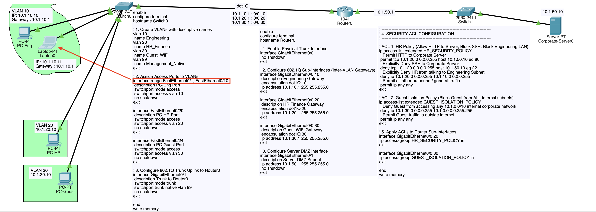

# Comprehensive VLAN & Access Control List (ACL) Lab (Packet Tracer)

This lab covers two fundamental pillars of network engineering and enterprise security:

* **Part 1: VLANs & 802.1Q Trunking:** Segmenting a physical switch into isolated Layer 2 broadcast domains and routing between them using **Router-on-a-Stick (ROAS)**.
* **Part 2: Standard vs. Extended Access Control Lists (ACLs):** Enforcing departmental security policies, protocol-level filtering (HTTP vs. SSH), and mitigating unauthorized access.

```
[ VLAN 10: Engineering ] ──┐
  10.1.10.0/24             │
                           ├──[Switch0: 2960]══(Trunk: Fa0/24)══(Gig0/0)[Router0]
[ VLAN 20: HR / Finance ] ─┤                                               │ (Gig0/1: 10.1.50.1/24)
  10.1.20.0/24             │                                               ▼
                           │                                          [Switch1: Server DMZ]
[ VLAN 34: Guest Wi-Fi ] ──┘                                               │
  10.1.30.0/24                                                             ▼
                                                                  [Corporate-Server0]
                                                                  IP: 10.1.50.10 (HTTP + SSH)
```

## Security Policy Matrix

| Source Subnet | Destination | Allowed Traffic | Blocked Traffic | Enforcement Method |
|---|---|---|---|---|
| **VLAN 10 (Engineering)** | Corporate Server | All (HTTP Port 80, SSH Port 22, ICMP Ping) | None | Explicit Permit |
| **VLAN 20 (HR / Finance)** | Corporate Server | HTTP (Port 80) only | SSH (Port 22), ICMP Ping | Extended ACL Filter |
| **VLAN 20 (HR / Finance)** | VLAN 10 (Engineering)| None | All inter-VLAN traffic | Extended ACL Filter |
| **VLAN 34 (Guest Wi-Fi)** | Internal Network | None (Complete Isolation) | All internal subnets (`10.1.0.0/16`) | Standard / Extended ACL |

## Addressing Plan

| Device                        | Interface | IP Address                 | Subnet Mask | Default Gateway | VLAN ID | Role |
|-------------------------------|---|----------------------------|---|---|---|---|
| **Router0**                   | `Gig0/0.10` | `10.1.10.1`                | `255.255.255.0` | — | 10 | Engineering Gateway |
| **Router0**                   | `Gig0/0.20` | `10.1.20.1`                | `255.255.255.0` | — | 20 | HR / Finance Gateway |
| **Router0**                   | `Gig0/0.30` | `10.1.30.1`                | `255.255.255.0` | — | 30 | Guest Wi-Fi Gateway |
| **Router0**                   | `Gig0/1` | `10.1.50.1`                | `255.255.255.0` | — | Routed | Server DMZ Gateway |
| **PC-Eng (VLAN 10)**, Laptop0 | `Fa0` | `10.1.10.10`, `10.1.10.11` | `255.255.255.0` | `10.1.10.1` | 10 | Engineering Workstation |
| **PC-HR (VLAN 20)**           | `Fa0` | `10.1.20.10`               | `255.255.255.0` | `10.1.20.1` | 20 | HR Workstation |
| **PC-Guest (VLAN 30)**        | `Fa0`| `10.1.30.10`               | `255.255.255.0` | `10.1.30.1` | 30 | Guest Laptop |
| **Corporate-Server0**         | `Fa0` | `10.1.50.10`               | `255.255.255.0` | `10.1.50.1` | — | DMZ Web (80) & SSH (22) Server |

## 1. Place and Cable Devices

### Devices Required
* 3x Generic PC (`PC-Eng`, `PC-HR`, `PC-Guest`)
* 2x Switch (`2960-24TT`: `Switch0`, `Switch1`)
* 1x Router (`1941`: `Router0`)
* 1x Server (`Corporate-Server0`)

### Cabling (Copper Straight-Through)
* `PC-Eng` (`Fa0`) <—> `Switch0` (`FastEthernet0/10`)
* `PC-HR` (`Fa0`) <—> `Switch0` (`FastEthernet0/20`)
* `PC-Guest` (`Fa0`) <—> `Switch0` (`FastEthernet0/24`)
* `Switch0` (`GigabitEthernet0/1`) <—> `Router0` (`GigabitEthernet0/0`)
* `Router0` (`GigabitEthernet0/1`) <—> `Switch1` (`GigabitEthernet0/1`)
* `Switch1` (`FastEthernet0/1`) <—> `Corporate-Server0` (`FastEthernet0`)

## 2. Switch0 Configuration (VLANs, Access Ports & Trunking)

Open **Switch0 CLI** to create the VLAN database and configure port memberships:

```text
enable
configure terminal
hostname Switch0

! 1. Create VLANs with descriptive names
vlan 10
 name Engineering
vlan 20
 name HR_Finance
vlan 30
 name Guest_WiFi
vlan 99
 name Management_Native
exit

! 2. Assign Access Ports to VLANs
interface range FastEthernet0/1, FastEthernet0/10
 description PC-Eng Port
 switchport mode access
 switchport access vlan 10
 no shutdown
exit

interface FastEthernet0/20
 description PC-HR Port
 switchport mode access
 switchport access vlan 20
 no shutdown
exit

interface FastEthernet0/24
 description PC-Guest Port
 switchport mode access
 switchport access vlan 30
 no shutdown
exit

! 3. Configure 802.1Q Trunk Uplink to Router0
interface GigabitEthernet0/1
 description Trunk to Router0
 switchport mode trunk
 switchport trunk native vlan 99
 no shutdown
exit

end
write memory
```

## 3. Router0 Configuration (Router-on-a-Stick & ACL Security)

Open **Router0 CLI**:

```text
enable
configure terminal
hostname Router0

! 1. Enable Physical Trunk Interface
interface GigabitEthernet0/0
 no shutdown
exit

! 2. Configure 802.1Q Sub-Interfaces (Inter-VLAN Gateways)
interface GigabitEthernet0/0.10
 description Engineering Gateway
 encapsulation dot1Q 10
 ip address 10.1.10.1 255.255.255.0
exit

interface GigabitEthernet0/0.20
 description HR Finance Gateway
 encapsulation dot1Q 20
 ip address 10.1.20.1 255.255.255.0
exit

interface GigabitEthernet0/0.30
 description Guest WiFi Gateway
 encapsulation dot1Q 30
 ip address 10.1.30.1 255.255.255.0
exit

! 3. Configure Server DMZ Interface
interface GigabitEthernet0/1
 description Server DMZ Subnet
 ip address 10.1.50.1 255.255.255.0
 no shutdown
exit

! -----------------------------------------------------------------------------
! 4. SECURITY ACL CONFIGURATION
! -----------------------------------------------------------------------------

! ACL 1: HR Policy (Allow HTTP to Server, Block SSH, Block Engineering LAN)
ip access-list extended HR_SECURITY_POLICY
 ! Permit HTTP to Corporate Server
 permit tcp 10.1.20.0 0.0.0.255 host 10.1.50.10 eq 80
 ! Explicitly Deny SSH to Corporate Server
 deny tcp 10.1.20.0 0.0.0.255 host 10.1.50.10 eq 22
 ! Explicitly Deny HR from talking to Engineering Subnet
 deny ip 10.1.20.0 0.0.0.255 10.1.10.0 0.0.0.255
 ! Permit all other outbound / general traffic
 permit ip any any
exit

! ACL 2: Guest Isolation Policy (Block Guest from ALL internal subnets)
ip access-list extended GUEST_ISOLATION_POLICY
 ! Deny Guest from accessing any 10.1.0.0/16 internal corporate network
 deny ip 10.1.30.0 0.0.0.255 10.1.0.0 0.0.255.255
 ! Permit Guest traffic to outside internet
 permit ip any any
exit

! 5. Apply ACLs to Router Sub-Interfaces
interface GigabitEthernet0/0.20
 ip access-group HR_SECURITY_POLICY in
exit

interface GigabitEthernet0/0.30
 ip access-group GUEST_ISOLATION_POLICY in
exit

end
write memory
```

## 4. End Device Configuration

### PC-Eng (`VLAN 10`)
* IP Address: `10.1.10.10`
* Subnet Mask: `255.255.255.0`
* Default Gateway: `10.1.10.1`

### PC-HR (`VLAN 20`)
* IP Address: `10.1.20.10`
* Subnet Mask: `255.255.255.0`
* Default Gateway: `10.1.20.1`

### PC-Guest (`VLAN 30`)
* IP Address: `10.1.30.10`
* Subnet Mask: `255.255.255.0`
* Default Gateway: `10.1.30.1`

### Corporate-Server0 (`DMZ`)
* IP Address: `10.1.50.10`
* Subnet Mask: `255.255.255.0`
* Default Gateway: `10.1.50.1`
* **Services tab:**
  * **HTTP:** Toggle **On**.
  * **SSH (or Telnet):** Ensure terminal services are **On**.

## 5. Verification and Security Testing

### Test Suite 1: Engineering Access (Full Privileges)
1. From **PC-Eng**, ping `Corporate-Server0`:
   ```text
   ping 10.1.50.10
   ```
   *(Success).*
2. Open **PC-Eng > Web Browser** and navigate to `http://10.1.50.10`.
   *(Success).*
3. From **PC-Eng > Command Prompt**, test SSH/Telnet connectivity:
   ```text
   telnet 10.1.50.10 22
   ```
   *(Connection established / Port open).*

### Test Suite 2: HR Access (HTTP Allowed, SSH & Eng Blocked)
1. Open **PC-HR > Web Browser** and navigate to `http://10.1.50.10`.
   *(Success: HTTP Port 80 is permitted by `HR_SECURITY_POLICY`).*
2. From **PC-HR > Command Prompt**, attempt SSH/Telnet on port 22:
   ```text
   telnet 10.1.50.10 22
   ```
   *(Connection failed / Timed out: Denied by ACL).*
3. Attempt to ping the Engineering PC:
   ```text
   ping 10.1.10.10
   ```
   *(Destination host unreachable / Denied by ACL).*

### Test Suite 3: Guest Isolation (Complete Internal Lockout)
1. From **PC-Guest**, attempt to ping `Corporate-Server0`:
   ```text
   ping 10.1.50.10
   ```
   *(Failed: Blocked by `GUEST_ISOLATION_POLICY`).*
2. Attempt to ping `PC-HR` (`10.1.20.10`):
   *(Failed: Blocked by `GUEST_ISOLATION_POLICY`).*

### Test Suite 4: Inspect ACL Hit Counters
On **Router0 CLI**, inspect rule matches:
```text
show ip access-lists
```
*Observation: You will see match counters increment for every permitted and denied packet (e.g. `(15 matches)`).*

## 6. Key Conceptual Rules for ACLs

| Rule | Explanation |
|---|---|
| **Standard vs. Extended ACLs** | Standard ACLs (1–99) only filter on **Source IP**. Extended ACLs (100–199) filter on **Source IP, Destination IP, Protocol, and Port** (e.g. TCP port 80). |
| **ACL Placement Rule** | Place **Extended ACLs as close to the Source as possible** (to drop unwanted packets early and save bandwidth). Place **Standard ACLs as close to the Destination as possible** (to prevent accidentally blocking wanted traffic elsewhere). |
| **The Implicit Deny** | Every Cisco ACL ends with an invisible `deny ip any any`. If a packet does not explicitly match a `permit` statement, it is dropped. Always add `permit ip any any` at the end if you only want to blacklist specific traffic. |
| **Inbound (`in`) vs. Outbound (`out`)** | `in` filters packets arriving into the router interface before routing decisions are made. `out` filters packets after the router has routed them out toward the destination wire. |
