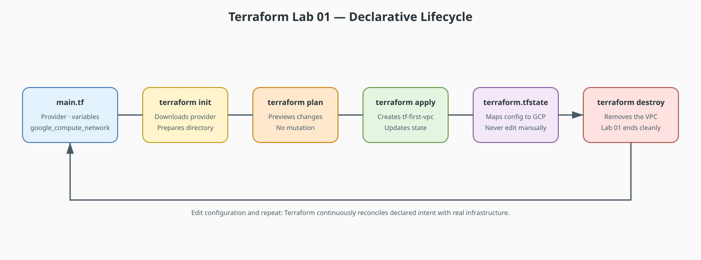

# Terraform Lab 01 — Setup, Providers & Your First Resource

This is the first lab in the **Terraform track**. It assumes zero Terraform
experience — only the networking concepts from the Packet Tracer labs
(subnets, gateways, NAT, DNS).

By the end you will have: Terraform installed, GCP authentication working,
and a real VPC created and destroyed from code.

## Lab contract

| Item | This lab |
|:-----|:---------|
| **Execution model** | Standalone introduction in `terraform-labs/01-first-vpc/` |
| **Starts from** | No prior Terraform state |
| **Creates** | One temporary custom-mode VPC |
| **Ends with** | `terraform destroy`; Lab 02 starts a new cumulative foundation |
| **Next** | [Lab 02 — VPC & Subnets](02-vpc-subnets.md) |

## Resource summary

| Terraform block | Count | Purpose | Reused later? |
|:----------------|------:|:--------|:--------------|
| `google_compute_network.first_vpc` | 1 | Demonstrates the resource lifecycle and custom-mode VPC setting | No; destroyed in this lab |

!!! note "Track continuity"
    Lab 01 is intentionally disposable. Labs 02–04 share one working directory and state. Lab 05 is a standalone consolidation of Labs 02–04. Labs 06–08 are standalone advanced scenarios so their overlapping CIDRs and resource names do not collide.

## Track resource progression

| Lab | State relationship | Main resources introduced | Outcome |
|:----|:-------------------|:--------------------------|:--------|
| 01 | Standalone and destroyed | VPC | Learn init, plan, apply, state, and destroy |
| 02 | Starts cumulative Labs 02–04 state | VPC and two subnets | Establish the shared foundation |
| 03 | Appends to Lab 02 | Cloud Router, Cloud NAT, firewall rules | Add egress and policy |
| 04 | Appends to Labs 02–03, then destroys | VMs, private DNS zone, record | Verify the complete foundation |
| 05 | New standalone state | Complete two-tier stack | Rebuild the foundation as one scenario |
| 06 | New standalone state | Two VPCs, subnets, peerings, firewall | Introduce multi-VPC connectivity |
| 07 | New standalone state | Health check, backend services, URL map, proxy, forwarding rule | Introduce L7 traffic distribution |
| 08 | New standalone state | Test VM, HA VPN, Cloud Router, tunnel, BGP peer | Complete the track with hybrid routing |

Every lab repeats its own **Lab contract** and **Resource summary** so it is clear
whether to append, start fresh, retain state, or destroy resources.



!!! tip "Editable source"
    Edit [`lab01-terraform-lifecycle.drawio`](diagrams/lab01-terraform-lifecycle.drawio) and export it as SVG after changes.

## The Mental Bridge

| Packet Tracer | Terraform |
|---|---|
| Drag a router onto the canvas | Declare a `resource` block in a `.tf` file |
| Device config lives in its RAM/NVRAM | Desired state lives in `.tf` files + state file (`terraform.tfstate`) |
| `write memory` saves your work | `terraform apply` makes reality match the code |
| Delete device & re-drag it | `terraform destroy` then `terraform apply` — no corruption possible |

!!! tip "Why this matters after the .pkt incident"
    Terraform's entire value proposition: your infrastructure is **text in
    git**. If anything breaks, `terraform apply` rebuilds it identically.

## 1. Install the tools

```bash
brew install terraform
brew install --cask gcloud-cli   # or: brew install google-cloud-sdk

terraform version
gcloud version
```

## 2. Authenticate to GCP

```bash
# Interactive login + Application Default Credentials for Terraform
gcloud auth login
gcloud auth application-default login

# Pick a billing-enabled project you are authorized to use
gcloud config set project YOUR_PROJECT_ID

# Enable the API used throughout the track
gcloud services enable compute.googleapis.com
```

## 3. The five commands that are 95% of Terraform

```text
terraform init      # download providers, prepare the working directory
terraform fmt       # auto-format .tf files (like a code formatter)
terraform plan      # dry-run: "here's what I WOULD change"
terraform apply     # make it real (asks for confirmation)
terraform destroy   # tear it all down
```

The `plan` → `apply` split is the safety mechanism PT never had: you always
see a diff before anything changes.

## 4. Your first configuration

Create a folder `terraform-labs/01-first-vpc/` and a single file `main.tf`:

```hcl
terraform {
  required_version = ">= 1.5.0"

  required_providers {
    google = {
      source  = "hashicorp/google"
      version = "~> 5.0"
    }
  }
}

provider "google" {
  project = var.project_id
  region  = var.region
}

variable "project_id" {
  description = "GCP project ID to deploy into"
  type        = string
}

variable "region" {
  description = "GCP region"
  type        = string
  default     = "us-central1"
}

# The cloud equivalent of drawing a network boundary in Packet Tracer
resource "google_compute_network" "first_vpc" {
  name                    = "tf-first-vpc"
  auto_create_subnetworks = false   # we will define subnets ourselves in lab 02
}
```

## 5. Run the lifecycle

```bash
cd terraform-labs/01-first-vpc

terraform init
terraform plan -var="project_id=YOUR_PROJECT_ID"
terraform apply -var="project_id=YOUR_PROJECT_ID"
```

Type `yes`. Then verify in the console:

```bash
gcloud compute networks list
```

Now tear it down — this is the part that feels magical after PT:

```bash
terraform destroy -var="project_id=YOUR_PROJECT_ID"
```

## 6. What just happened (concepts to internalize)

- **Provider** = the plugin that translates `resource` blocks into GCP API
  calls (`hashicorp/google` here).
- **Resource** = one real thing in the cloud. `google_compute_network` is
  the VPC boundary — the same conceptual "container" your Packet Tracer
  topology lived inside.
- **State file** (`terraform.tfstate`) = Terraform's record of what it
  created. Never edit it by hand; `.gitignore` it in real projects.
- **Variable** = a parameter, so the same code works across
  projects/regions.

## 7. Checklist before lab 02

- [ ] `terraform apply` created a VPC visible via `gcloud compute networks list`
- [ ] `terraform destroy` removed it cleanly
- [ ] You can explain: plan shows intent, apply executes, state records reality
- [ ] `auto_create_subnetworks = false` — because in lab 02 we control the
      subnets ourselves, exactly like choosing `/24` ranges in Packet Tracer

**Next:** [Lab 02 — VPC & Subnets: Recreating the Packet Tracer Topology](02-vpc-subnets.md)
