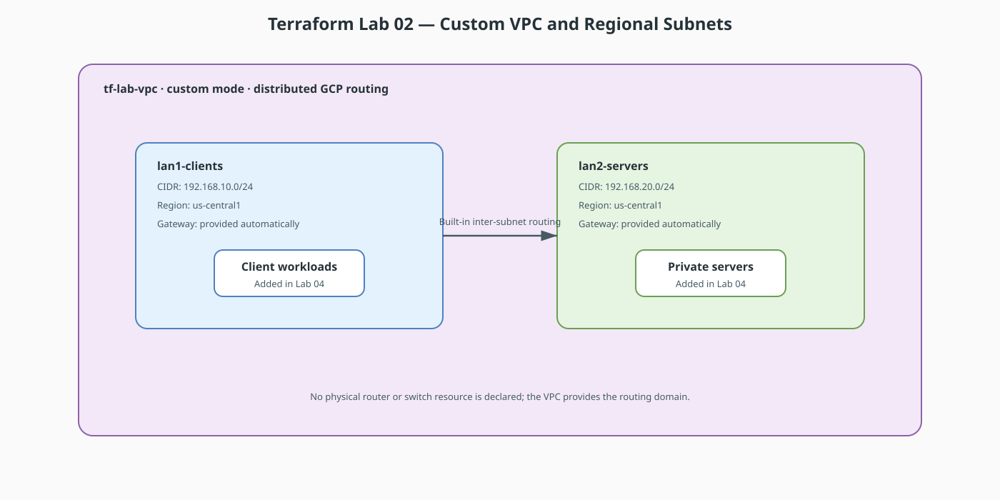

# Terraform Lab 02 — VPC & Subnets: Recreating the Packet Tracer Topology

In [lab 4 (DHCP)](../labs/lab4-DHCP/4-dhcp_lab.md) you built two LANs on a
router:

* **LAN 1 (clients):** `192.168.10.0/24`, gateway `192.168.10.1`
* **LAN 2 (server farm):** `192.168.20.0/24`, gateway `192.168.20.1`

Now we rebuild that exact topology as a GCP VPC — same CIDRs, same roles.

## Lab contract

| Item | This lab |
|:-----|:---------|
| **Execution model** | Start the cumulative `terraform-labs/02-04-foundation/` configuration |
| **Starts from** | Lab 01 completed and destroyed; reuse its provider/variable pattern, not its state |
| **Creates** | One VPC and two regional subnets |
| **Keep after completion** | Yes; Labs 03 and 04 append resources to this same configuration and state |
| **Next** | [Lab 03 — Routing, NAT & Firewall](03-routing-nat-firewall.md) |

## Resource summary

| Terraform block | Count | Purpose | Introduced here |
|:----------------|------:|:--------|:----------------|
| `google_compute_network.lab_vpc` | 1 | Custom-mode routing domain | Yes |
| `google_compute_subnetwork.lan1_clients` | 1 | Client/public-facing workload subnet | Yes |
| `google_compute_subnetwork.lan2_servers` | 1 | Private server subnet | Yes |



!!! tip "Editable source"
    Edit [`lab02-vpc-subnets.drawio`](diagrams/lab02-vpc-subnets.drawio) and export it as SVG after changes.

## Concept Map

| Packet Tracer | GCP / Terraform |
|---|---|
| The blank canvas | `google_compute_network` (the VPC) |
| `192.168.10.0/24` behind `Gig0/0` | `google_compute_subnetwork` in a region |
| Router interface `192.168.10.1` | Automatic — GCP reserves `.1` as the subnet gateway |
| Switch0 / Switch1 | No equivalent needed — subnets are L2/L3 by definition |

!!! note "Where did the router and switches go?"
    In the cloud, routing *inside* a VPC is implicit — every subnet can
    reach every other subnet by default. You never model the router itself.
    What you *do* model is what you add on top: NAT, firewall rules, custom
    routes, NAT, firewall policy, and VPNs (Labs 03–04 and 06–08).

## Addressing Plan (identical to the .pkt lab)

| Subnet | CIDR | Region | Purpose |
|---|---|---|---|
| `lan1-clients` | `192.168.10.0/24` | `us-central1` | "Sales/clients" side |
| `lan2-servers` | `192.168.20.0/24` | `us-central1` | "Server farm" side |

## `main.tf`

```hcl
terraform {
  required_version = ">= 1.5.0"

  required_providers {
    google = {
      source  = "hashicorp/google"
      version = "~> 5.0"
    }
  }
}

provider "google" {
  project = var.project_id
  region  = var.region
}

variable "project_id" {
  description = "GCP project ID to deploy into"
  type        = string
}

variable "region" {
  description = "GCP region for both subnets"
  type        = string
  default     = "us-central1"
}

# 1. The network boundary (like the Packet Tracer workspace)
resource "google_compute_network" "lab_vpc" {
  name                    = "tf-lab-vpc"
  auto_create_subnetworks = false
}

# 2. LAN 1 — the client network (was behind Router0/Gig0/0)
resource "google_compute_subnetwork" "lan1_clients" {
  name          = "lan1-clients"
  ip_cidr_range = "192.168.10.0/24"
  region        = var.region
  network       = google_compute_network.lab_vpc.id
}

# 3. LAN 2 — the server farm (was behind Router0/Gig0/1)
resource "google_compute_subnetwork" "lan2_servers" {
  name          = "lan2-servers"
  ip_cidr_range = "192.168.20.0/24"
  region        = var.region
  network       = google_compute_network.lab_vpc.id
}
```

## Apply & Verify

```bash
terraform init
terraform apply -var="project_id=YOUR_PROJECT_ID"

# See the subnets — the cloud equivalent of "show ip interface brief"
gcloud compute networks subnets list --network=tf-lab-vpc
```

Look at the output: each subnet shows `192.168.x.1` as its gateway —
GCP automatically assigns `.1` as the gateway, matching the router
interface IPs from your Packet Tracer lab.

## What to notice

1. **No router resource.** In PT you needed Router0 to connect the two
   LANs; in a VPC, inter-subnet routing is built in.
2. **`ip_cidr_range` is the subnet** — the same CIDR notation you practiced
   subnetting with (`/24` = 256 addresses).
3. **`network = google_compute_network.lab_vpc.id`** — this is a
   *reference*, not a string. Terraform builds a dependency graph from
   references, so it creates the VPC before the subnets. This is the core
   mental model of IaC.
4. Change `192.168.10.0/24` to `192.168.30.0/24` and `terraform plan`
   again — Terraform shows an *update in place* vs *destroy+recreate*
   decision, something a GUI could never show you.

## Exercise

Add a third subnet `lan3-dmz` at `192.168.30.0/24` purely by copying a
resource block and changing the name/CIDR. `plan`, inspect, `apply`.

## Checklist before lab 03

- [ ] Two subnets exist in `tf-lab-vpc` with the PT lab's exact CIDRs
- [ ] You understand why there is no "router" resource
- [ ] You can read a `plan` diff and predict create/update/destroy

**Next:** [Lab 03 — Routes, Firewall Rules & Cloud NAT](03-routing-nat-firewall.md)
