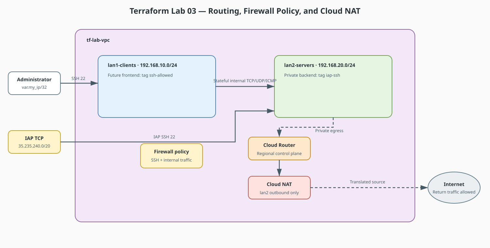

# Terraform Lab 03 — Routes, Firewall Rules & Cloud NAT

Your Packet Tracer labs 3 and 6 configured **NAT/PAT overload** and ACLs on
Router0 so private clients could reach the internet. In GCP, those map to
three separate resources — and unlike PT, you declare each piece explicitly.

## Lab contract

| Item | This lab |
|:-----|:---------|
| **Execution model** | Cumulative; append to the Lab 02 working directory and state |
| **Starts from** | `lab_vpc`, `lan1_clients`, and `lan2_servers` from Lab 02 |
| **Adds** | Cloud Router, Cloud NAT, and narrowly scoped ingress rules |
| **Keep after completion** | Yes; Lab 04 attaches VMs and private DNS to these resources |
| **Next** | [Lab 04 — VMs & Private DNS](04-vms-and-dns.md) |

## Resource summary

| Terraform block | Count | Purpose | Depends on |
|:----------------|------:|:--------|:-----------|
| `google_compute_router.nat_router` | 1 | Regional control-plane resource required by Cloud NAT | Lab 02 VPC |
| `google_compute_router_nat.nat` | 1 | Outbound translation for the private server subnet | Router and `lan2_servers` |
| `google_compute_firewall.allow_ssh` | 1 | SSH to explicitly tagged public-facing VMs from `var.my_ip` | Lab 02 VPC |
| `google_compute_firewall.allow_iap_ssh` | 1 | IAP TCP forwarding to explicitly tagged private VMs | Lab 02 VPC |
| `google_compute_firewall.allow_internal` | 1 | TCP, UDP, and ICMP between the two lab CIDRs | Lab 02 VPC |

## Concept Map

| Packet Tracer | GCP / Terraform |
|---|---|
| `ip nat inside/outside` + PAT overload | `google_compute_router` + `google_compute_router_nat` (Cloud NAT) |
| `access-list 1 permit ...` | `google_compute_firewall` rules |
| `ip route 0.0.0.0 0.0.0.0 <next-hop>` | `google_compute_route` (usually unnecessary — defaults exist) |

!!! warning "Cost"
    Cloud Router + NAT is the first resource in this track that can cost
    real money (~$1/day idle). `terraform destroy` when done. Free-tier
    `e2-micro` VMs used later are effectively free.

## The scenario

The `lan2-servers` subnet (from lab 02) will host VMs with **no public IP**.
Like your PT clients behind PAT, they need outbound internet for updates —
via Cloud NAT. And like your ACLs, we lock ingress down with firewall rules.



!!! tip "Editable source"
    Edit [`lab03-routing-nat-firewall.drawio`](../diagrams/lab03-routing-nat-firewall.drawio) and export it as SVG after changes.

## `main.tf` (append to lab 02's config)

```hcl
variable "my_ip" {
  description = "Your public IP in CIDR form, for SSH access (e.g. 203.0.113.7/32)"
  type        = string
}

# --- Cloud NAT: the cloud version of "ip nat inside source list ... overload" ---

resource "google_compute_router" "nat_router" {
  name    = "tf-lab-nat-router"
  network = google_compute_network.lab_vpc.id
  region  = var.region
}

resource "google_compute_router_nat" "nat" {
  name   = "tf-lab-nat"
  router = google_compute_router.nat_router.name
  region = var.region

  nat_ip_allocate_option = "AUTO_ONLY"   # PAT behavior: shared ephemeral IPs

  source_subnetwork_ip_ranges_to_nat = "LIST_OF_SUBNETWORKS"

  subnetwork {
    name                    = google_compute_subnetwork.lan2_servers.id
    source_ip_ranges_to_nat = ["ALL_IP_RANGES"]
  }
}

# --- Firewall rules: the cloud version of ACLs ---

# Allow SSH to instances tagged "ssh-allowed", only from your IP
resource "google_compute_firewall" "allow_ssh" {
  name    = "tf-allow-ssh"
  network = google_compute_network.lab_vpc.id

  direction     = "INGRESS"
  source_ranges = [var.my_ip]

  allow {
    protocol = "tcp"
    ports    = ["22"]
  }

  target_tags = ["ssh-allowed"]
}

# Allow all traffic between our two subnets (like inter-VLAN routing permitting LANs)
resource "google_compute_firewall" "allow_iap_ssh" {
  name    = "tf-allow-iap-ssh"
  network = google_compute_network.lab_vpc.id

  direction     = "INGRESS"
  source_ranges = ["35.235.240.0/20"]

  allow {
    protocol = "tcp"
    ports    = ["22"]
  }

  target_tags = ["iap-ssh"]
}

resource "google_compute_firewall" "allow_internal" {
  name    = "tf-allow-internal"
  network = google_compute_network.lab_vpc.id

  direction     = "INGRESS"
  source_ranges = ["192.168.10.0/24", "192.168.20.0/24"]

  allow {
    protocol = "tcp"
  }

  allow {
    protocol = "udp"
  }

  allow {
    protocol = "icmp"
  }
}
```

## Apply & Verify

```bash
# Find your IP for the SSH rule
curl -s ifconfig.me

terraform apply \
  -var="project_id=YOUR_PROJECT_ID" \
  -var="my_ip=$(curl -s ifconfig.me)/32"

gcloud compute routers describe tf-lab-nat-router --region=us-central1
gcloud compute firewall-rules list --filter="network=tf-lab-vpc"
```

## What to notice

1. **NAT is two resources, not one command.** PT collapsed NAT into a few
   IOS lines; cloud splits it into *router* (control plane) and *nat*
   (the translation service). `AUTO_ONLY` + `ALL_IP_RANGES` ≈ PAT overload.
2. **Firewall rules are stateful by default** — like PT's reflexive
   behavior once NAT/established sessions are involved. Return traffic is
   automatically allowed; no `permit ip any any established` needed.
3. **`target_tags`** select which VMs a rule applies to — the equivalent
   of applying an ACL to a specific interface.
4. **Implied deny-all**: GCP denies unmatched ingress by default, exactly
   like the implicit `deny any` at the end of a Cisco ACL.
5. Notice there is **no `google_compute_route` for the default route** —
   GCP gives every VPC a `0.0.0.0/0 → internet gateway` route for free.

## Exercises

1. Remove `icmp` from `allow_internal`, `plan`, predict what breaks
   (hint: ping between subnets), then `apply` and reason about it.
2. Change `source_ranges` of `allow_ssh` to `0.0.0.0/0` — run `plan` and
   observe how easy it is to *see* a security mistake as a diff. Revert.

## Checklist before lab 04

- [ ] Cloud NAT exists and is bound to `lan2-servers` only
- [ ] Direct SSH is allowed only from your IP to `ssh-allowed` VMs
- [ ] IAP SSH is allowed only from Google's IAP TCP range to `iap-ssh` VMs
- [ ] You can name the PT equivalent of each resource

**Next:** [Lab 04 — VMs, Private DNS & Verification](04-vms-and-dns.md)
