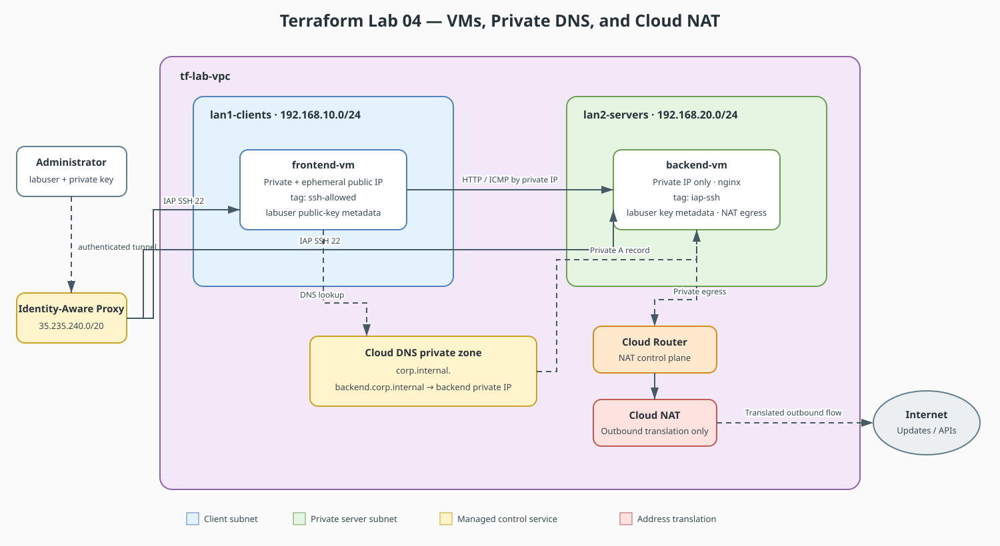

# Terraform Lab 04 — VMs, Private DNS & Verification

The last foundational lab: put actual machines in the subnets, replace
PT's "Server-PT" with a real VM, and replace the lab-5 DNS server with
Cloud DNS — then verify connectivity the same way you did in Packet Tracer
(ping, curl, name resolution).

## Lab contract

| Item | This lab |
|:-----|:---------|
| **Execution model** | Final cumulative stage in the Labs 02–04 working directory |
| **Starts from** | VPC/subnets from Lab 02 and NAT/firewall policy from Lab 03 |
| **Adds** | Two VMs, one private DNS zone, and one A record |
| **Ends with** | Verify the complete foundation, then destroy the shared Labs 02–04 state |
| **Next** | [Lab 05 — Standalone Two-Tier Scenario](../05-two-tier-networking-scenario/index.md) |

## Resource summary

| Terraform block | Count | Purpose | Depends on |
|:----------------|------:|:--------|:-----------|
| `google_compute_instance.frontend_vm` | 1 | Public test client/bastion tagged for restricted SSH | Client subnet and Lab 03 SSH rule |
| `google_compute_instance.backend_vm` | 1 | Private nginx server using Cloud NAT for egress | Server subnet, NAT, and IAP SSH rule |
| `google_dns_managed_zone.corp_internal` | 1 | Private `corp.internal.` namespace attached to the VPC | Lab 02 VPC |
| `google_dns_record_set.backend_a` | 1 | Resolves the backend name to its computed private address | DNS zone and backend VM |

## Concept Map

| Packet Tracer | GCP / Terraform |
|---|---|
| PC-PT / Server-PT devices | `google_compute_instance` (VMs) |
| Desktop → IP Config → DHCP | Automatic — every VM gets DHCP from its subnet |
| Lab-5 DNS server (A records) | `google_dns_managed_zone` + `google_dns_record_set` |
| Command Prompt → `ping` / `ipconfig` | `gcloud compute ssh` → `ping` / `ip addr` |

## The scenario



*Color key: blue = client subnet, green = private server subnet, yellow = managed control service, and red = address translation.*

Two VMs mirror Packet Tracer's “client talks to a server on another subnet,” while the diagram separates data flows from DNS, administration, and outbound translation.


## `main.tf` (append to labs 02+03)

```hcl
# --- Frontend VM: plays the "PC0" role, reachable via SSH ---
resource "google_compute_instance" "frontend_vm" {
  name         = "frontend-vm"
  machine_type = "e2-micro"          # free-tier eligible
  zone         = "${var.region}-a"

  tags = ["ssh-allowed"]             # picks up the lab-03 SSH firewall rule

  boot_disk {
    initialize_params {
      image = "debian-cloud/debian-12"
    }
  }

  network_interface {
    subnetwork = google_compute_subnetwork.lan1_clients.id
    access_config {}                 # empty block = ephemeral public IP
  }
}

# --- Backend VM: plays the "DHCP-Server0" role, private only ---
resource "google_compute_instance" "backend_vm" {
  name         = "backend-vm"
  machine_type = "e2-micro"
  zone         = "${var.region}-a"

  tags = ["iap-ssh"]

  boot_disk {
    initialize_params {
      image = "debian-cloud/debian-12"
    }
  }

  network_interface {
    subnetwork = google_compute_subnetwork.lan2_servers.id
    # no access_config → NO public IP; outbound goes through Cloud NAT
  }

  metadata_startup_script = "apt-get update && apt-get install -y nginx"
}

# --- Private DNS: replaces the lab-5 DNS server ---
resource "google_dns_managed_zone" "corp_internal" {
  name        = "corp-internal"
  dns_name    = "corp.internal."
  description = "Private zone for internal service names"

  visibility = "private"

  private_visibility_config {
    networks {
      network_url = google_compute_network.lab_vpc.id
    }
  }
}

resource "google_dns_record_set" "backend_a" {
  name         = "backend.${google_dns_managed_zone.corp_internal.dns_name}"
  type         = "A"
  ttl          = 300
  managed_zone = google_dns_managed_zone.corp_internal.name

  rrdatas = [google_compute_instance.backend_vm.network_interface[0].network_ip]
}
```

## Apply & Verify — the same tests you ran in PT

```bash
gcloud services enable dns.googleapis.com iap.googleapis.com

terraform apply \
  -var="project_id=YOUR_PROJECT_ID" \
  -var="my_ip=$(curl -s ifconfig.me)/32"

# 1. "ipconfig /all" equivalent — see both VMs' addresses
gcloud compute instances list

# 2. SSH into the frontend (needs the lab-03 firewall rule + tag)
gcloud compute ssh frontend-vm --zone=us-central1-a

# 3. From inside frontend-vm — the PT "ping across subnets" test:
ping -c3 <backend-vm-internal-ip>

# 4. The DNS test — resolves via your private zone, not public DNS:
ping -c3 backend.corp.internal
curl http://backend.corp.internal     # nginx installed by startup script

# 5. Proof NAT works: connect through IAP, then test outbound egress.
#    This requires IAP TCP forwarding IAM permission for your identity.
gcloud compute ssh backend-vm --zone=us-central1-a --tunnel-through-iap
curl -s ifconfig.me                  # returns the Cloud NAT public IP
```

## What to notice

1. **DHCP is invisible.** Every VM gets its private IP from the subnet
   automatically — the PT "IP Configuration → DHCP" step still happens,
   you just don't configure it. Reservation is possible, but rarely needed.
2. **`access_config {}`** is the entire difference between "has public IP"
   and "private VM." One empty block.
3. **Startup script ≈ PT's Services tab.** Instead of toggling HTTP on the
   server GUI, the VM installs nginx on first boot — config as text.
4. **The A record references the VM's IP attribute**
   (`network_interface[0].network_ip`) — you don't hardcode `10.x` values;
   the dependency graph wires them together.
5. **`--tunnel-through-iap`** is how you SSH to a machine with no public
   IP — the cloud equivalent of PT letting you click into a device with
   no route to you.

## Teardown

```bash
terraform destroy \
  -var="project_id=YOUR_PROJECT_ID" \
  -var="my_ip=0.0.0.0/32"   # any valid value; destroy doesn't use it
```

Verify nothing remains: `gcloud compute instances list` should be empty.

## Checklist — Terraform foundations complete when:

- [ ] Both VMs up; frontend SSH-able, backend private-only
- [ ] `backend.corp.internal` resolves from frontend-vm (private DNS works)
- [ ] backend-vm reaches the internet through Cloud NAT
- [ ] `terraform destroy` left zero resources (and zero billing)

## Where to go next — the advanced labs

You now have every primitive used by the existing labs:

* [Stage 05 — Two-Tier Networking Scenario](../05-two-tier-networking-scenario/index.md) — this same architecture, end-to-end
* [Stage 06 — VPC Peering & Shared VPC](../06-vpc-peering-shared-vpc/index.md) — connecting *two* VPCs (multi-router, cloud-style)
* [Stage 07 — L4 & L7 Load Balancing](../07-load-balancing-l4-l7/index.md) — the cloud version of "the server"
* [Stage 08 — IPsec VPN & BGP](../08-ipsec-vpn-bgp-hybrid/index.md) — hybrid cloud, the far edge of networking
