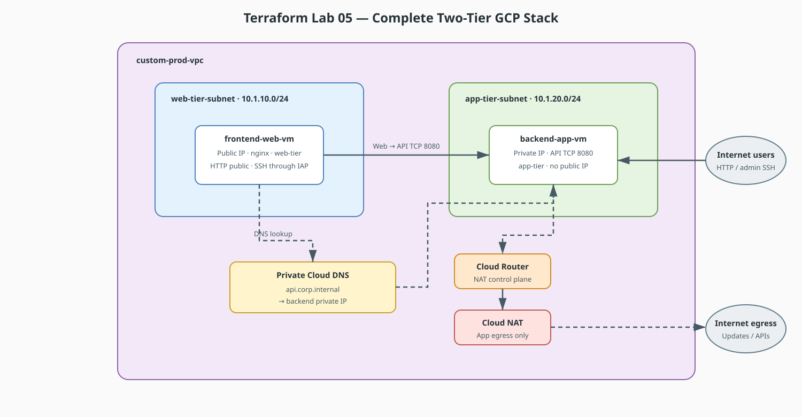

# Terraform Lab 05 — Two-Tier GCP Networking Scenario

Now that you understand Subnetting, Default Gateways, NAT/PAT, DNS, and Routing from Packet Tracer, this guide translates those exact concepts into **Google Cloud Platform (GCP) software-defined networking using Terraform (Infrastructure as Code)**.

## Lab contract

| Item | This lab |
|:-----|:---------|
| **Execution model** | Standalone consolidation in a new working directory and state |
| **Starts from** | Labs 01–04 completed; their resources should be destroyed |
| **Creates** | A complete two-tier VPC, NAT, policy, DNS, and VM stack |
| **Why standalone** | It rebuilds the foundation with new names and CIDRs rather than appending to Lab 04 |
| **Next** | [Lab 06 — VPC Peering & Shared VPC](../06-vpc-peering-shared-vpc/index.md) |

## Resource summary

| Resource type | Count | Purpose |
|:--------------|------:|:--------|
| `google_compute_network` | 1 | Custom production-style VPC |
| `google_compute_subnetwork` | 2 | Web and private application tiers |
| `google_compute_router` / `google_compute_router_nat` | 1 each | Private application-tier egress |
| `google_compute_firewall` | 3 | Public HTTP, restricted administration, and web-to-app policy |
| `google_dns_managed_zone` / `google_dns_record_set` | 1 each | Private backend service discovery |
| `google_compute_instance` | 2 | Frontend and private backend workloads |

!!! warning "New state, not an append"
    Do not paste this complete configuration into the Labs 02–04 directory. Names, CIDRs, and Terraform addresses differ; use a new folder such as `terraform-labs/05-two-tier/`.

## The Mental Bridge: Physical vs. GCP vs. Terraform

| Physical / Packet Tracer Concept | GCP Cloud Equivalent | Terraform Resource (`google_...`) | What It Does |
|---|---|---|---|
| **Autonomous System / Boundary** | **VPC (Virtual Private Cloud)** | `google_compute_network` | Software-defined global routing domain. |
| **Subnet (`/24`, `/26`)** | **Custom Subnet** | `google_compute_subnetwork` | Regional IP address pool bounded by CIDR. |
| **Router Interface / Default Gateway** | **Default Internet Gateway / Routes** | `google_compute_route` | Automatically routes between subnets and to the internet. |
| **NAT Overload / PAT** | **Cloud Router + Cloud NAT** | `google_compute_router`<br>`google_compute_router_nat` | Allows private VMs to reach the internet without public IPs. |
| **Switch ACLs / Router Filters** | **VPC Firewall Rules** | `google_compute_firewall` | Stateful ingress and egress traffic filtering. |
| **Dedicated DNS Server** | **Cloud DNS (Private Zone)** | `google_dns_managed_zone`<br>`google_dns_record_set` | Resolves internal domain names across VPC instances. |
| **Physical Server / Host** | **Compute Engine (VM Instance)** | `google_compute_instance` | Virtual machine connected to a specific subnet. |

## The Scenario: Secure 2-Tier Architecture

You are provisioning a real-world enterprise infrastructure in `us-central1`:

* **Web Subnet (`10.1.10.0/24`):** Hosts a public-facing Web Server (`frontend-vm`) accessible via HTTP on port 80.
* **App Subnet (`10.1.20.0/24`):** Hosts a private backend Application Server (`backend-vm`) with **NO public IP**.
* **Cloud NAT:** The backend VM reaches external APIs and software updates safely via Cloud NAT.
* **Private Cloud DNS:** The Web Server communicates with the backend using the internal domain name `api.corp.internal`.




## Complete Terraform Configuration (`main.tf`)

Here is the complete, modular Terraform file implementing the entire architecture:

```hcl
terraform {
  required_version = ">= 1.5.0"
  required_providers {
    google = {
      source  = "hashicorp/google"
      version = "~> 5.0"
    }
  }
}

provider "google" {
  project = var.project_id
  region  = var.region
}

variable "project_id" {
  description = "GCP project ID to deploy into"
  type        = string
}

variable "region" {
  description = "GCP region for the two-tier stack"
  type        = string
  default     = "us-central1"
}

variable "my_ip" {
  description = "Administrator public IP in CIDR form for SSH, for example 203.0.113.7/32"
  type        = string
}

# -----------------------------------------------------------------------------
# 1. VPC NETWORK & SUBNETS
# -----------------------------------------------------------------------------

# Always use auto_create_subnetworks = false (Custom Mode) in production!
resource "google_compute_network" "vpc_network" {
  name                    = "custom-prod-vpc"
  auto_create_subnetworks = false
  description             = "Custom Enterprise Production VPC"
}

# Web Tier Subnet (Public Ingress)
resource "google_compute_subnetwork" "web_subnet" {
  name          = "web-tier-subnet"
  ip_cidr_range = "10.1.10.0/24"
  region        = var.region
  network       = google_compute_network.vpc_network.id
}

# Backend App Tier Subnet (Private Isolated)
resource "google_compute_subnetwork" "app_subnet" {
  name          = "app-tier-subnet"
  ip_cidr_range = "10.1.20.0/24"
  region        = var.region
  network       = google_compute_network.vpc_network.id
  private_ip_google_access = true
}

# -----------------------------------------------------------------------------
# 2. CLOUD ROUTER & CLOUD NAT (The Cloud Equivalent of PAT Overload)
# -----------------------------------------------------------------------------

resource "google_compute_router" "nat_router" {
  name    = "prod-nat-router"
  region  = google_compute_subnetwork.app_subnet.region
  network = google_compute_network.vpc_network.id
}

resource "google_compute_router_nat" "app_nat" {
  name                               = "prod-cloud-nat"
  router                             = google_compute_router.nat_router.name
  region                             = google_compute_router.nat_router.region
  nat_ip_allocate_option             = "AUTO_ONLY"
  source_subnetwork_ip_ranges_to_nat = "LIST_OF_SUBNETWORKS"

  subnetwork {
    name                    = google_compute_subnetwork.app_subnet.id
    source_ip_ranges_to_nat = ["ALL_IP_RANGES"]
  }
}

# -----------------------------------------------------------------------------
# 3. FIREWALL RULES (Stateful Traffic Filters)
# -----------------------------------------------------------------------------

resource "google_compute_firewall" "allow_web_http" {
  name    = "allow-web-http"
  network = google_compute_network.vpc_network.name

  allow {
    protocol = "tcp"
    ports    = ["80"]
  }

  source_ranges = ["0.0.0.0/0"]
  target_tags   = ["web-tier"]
}

resource "google_compute_firewall" "allow_admin_ssh" {
  name    = "allow-admin-ssh"
  network = google_compute_network.vpc_network.name

  allow {
    protocol = "tcp"
    ports    = ["22"]
  }

  source_ranges = [var.my_ip]
  target_tags   = ["web-tier"]
}

# Allow Web Tier to reach Backend App Tier on Port 8080 (Internal East-West)
resource "google_compute_firewall" "allow_web_to_app" {
  name    = "allow-web-to-app-internal"
  network = google_compute_network.vpc_network.name

  allow {
    protocol = "tcp"
    ports    = ["8080"]
  }

  allow {
    protocol = "icmp"
  }

  source_tags = ["web-tier"]
  target_tags = ["app-tier"]
}

# -----------------------------------------------------------------------------
# 4. PRIVATE CLOUD DNS (Internal Name Resolution)
# -----------------------------------------------------------------------------

resource "google_dns_managed_zone" "private_zone" {
  name        = "corp-internal-zone"
  dns_name    = "corp.internal."
  description = "Private internal DNS zone for VPC instances"
  visibility  = "private"

  private_visibility_config {
    networks {
      network_url = google_compute_network.vpc_network.id
    }
  }
}

# A-Record mapping api.corp.internal to Backend VM's Private IP
resource "google_dns_record_set" "backend_dns_record" {
  name         = "api.corp.internal."
  managed_zone = google_dns_managed_zone.private_zone.name
  type         = "A"
  ttl          = 300
  rrdatas      = [google_compute_instance.backend_vm.network_interface[0].network_ip]
}

# -----------------------------------------------------------------------------
# 5. COMPUTE ENGINE VIRTUAL MACHINES
# -----------------------------------------------------------------------------

# Frontend Web Server (Has Public IP)
resource "google_compute_instance" "frontend_vm" {
  name         = "frontend-web-vm"
  machine_type = "e2-micro"
  zone         = "${var.region}-a"
  tags         = ["web-tier"]

  boot_disk {
    initialize_params {
      image = "debian-cloud/debian-11"
    }
  }

  network_interface {
    subnetwork = google_compute_subnetwork.web_subnet.id
    access_config {
      # Presence of access_config assigns a Public IP
    }
  }

  metadata_startup_script = <<-EOF
    #!/bin/bash
    apt-get update
    apt-get install -y nginx
    echo "<h1>Welcome to Frontend Web Tier</h1>" > /var/www/html/index.html
  EOF
}

# Backend App Server (Private IP ONLY - No access_config block!)
resource "google_compute_instance" "backend_vm" {
  name         = "backend-app-vm"
  machine_type = "e2-micro"
  zone         = "${var.region}-a"
  tags         = ["app-tier"]

  boot_disk {
    initialize_params {
      image = "debian-cloud/debian-11"
    }
  }

  network_interface {
    subnetwork = google_compute_subnetwork.app_subnet.id
    # No access_config block means NO Public IP (Fully Private)
  }

  metadata_startup_script = <<-EOF
    #!/bin/bash
    apt-get update
    apt-get install -y python3
    # Start a simple HTTP listener on port 8080
    echo "Backend API Service Response" > response.txt
    nohup python3 -m http.server 8080 &
  EOF
}
```

## Key Networking Concepts Explained in Terraform

### 1. Why `auto_create_subnetworks = false`?
In standard GCP, an "Auto Mode" VPC automatically creates a `/20` subnet in every single region across the globe. In professional environments, you always use **Custom Mode** (`auto_create_subnetworks = false`) to maintain strict control over IP CIDR design, exactly like designing subnets in your Packet Tracer labs.

### 2. How Cloud NAT Replaces the Router Gig0/1 NAT Config
In our earlier lab, we ran `ip nat inside source list 1 interface gig0/1 overload`. In GCP:
* The `backend-vm` has no `access_config` (no public IP), making it completely unreachable from the internet.
* When `backend-vm` runs `apt-get update`, outbound packets hit `google_compute_router_nat`, which translates the private IP `10.1.20.2` to a temporary GCP public IP to fetch packages, then forwards replies back internally.

### 3. How Target Tags Implement Micro-Segmentation
Instead of configuring access-lists on router ports, GCP uses **Network Tags** (`tags = ["web-tier"]` and `tags = ["app-tier"]`). The firewall rule `allow_web_to_app` only permits traffic from instances tagged `web-tier` to instances tagged `app-tier` on port `8080`, isolating the backend from all other unauthorized machines.

### 4. How Cloud DNS Eliminates Hard-Coded IPs
By attaching `google_dns_managed_zone` to the VPC, `frontend_vm` can make HTTP requests to `http://api.corp.internal:8080`. Even if the backend VM is destroyed and recreated with a new dynamic private IP, Terraform automatically updates the DNS record, ensuring zero broken dependencies.

## Apply and verify

```bash
gcloud services enable compute.googleapis.com dns.googleapis.com

terraform init
terraform fmt
terraform validate
terraform plan \
  -var="project_id=YOUR_PROJECT_ID" \
  -var="my_ip=$(curl -s ifconfig.me)/32"
terraform apply \
  -var="project_id=YOUR_PROJECT_ID" \
  -var="my_ip=$(curl -s ifconfig.me)/32"
```

Once applied:

```bash
# 1. SSH into the Frontend Web VM
gcloud compute ssh frontend-web-vm --zone=us-central1-a

# 2. Test DNS resolution of the backend service
nslookup api.corp.internal

# 3. Test HTTP connectivity to the private backend application tier
curl http://api.corp.internal:8080

# Expected Output: "Backend API Service Response"
```

## Cleanup and next step

```bash
terraform destroy \
  -var="project_id=YOUR_PROJECT_ID" \
  -var="my_ip=$(curl -s ifconfig.me)/32"
```

Continue to [Lab 06 — VPC Peering & Shared VPC](../06-vpc-peering-shared-vpc/index.md).
