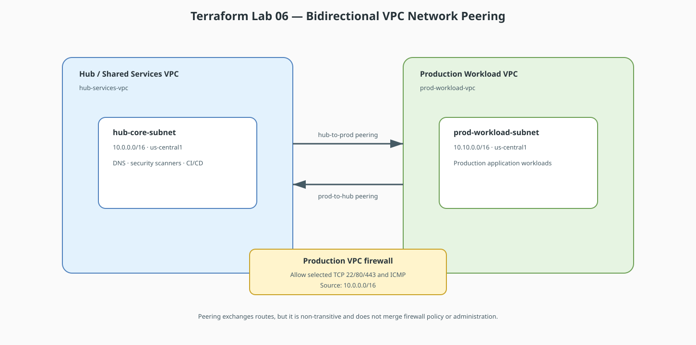

# Terraform Lab 06 — VPC Network Peering & Shared VPC

In production cloud environments, single monolithic VPCs are rarely used. Instead, organizations deploy **Multi-VPC Hub-and-Spoke** topologies or **Shared VPCs** to segregate environments (Production vs. Staging vs. Shared Services).

## Lab contract

| Item | This lab |
|:-----|:---------|
| **Execution model** | Standalone advanced scenario with a new working directory and state |
| **Starts from** | Provider/variable scaffolding from Lab 01; conceptual knowledge from Lab 05 |
| **Creates** | Two non-overlapping VPCs, two subnets, bidirectional peering, and cross-VPC policy |
| **Scope boundary** | Demonstrates peering in one project; Shared VPC is compared conceptually, not provisioned |
| **Next** | [Lab 07 — L4 & L7 Load Balancing](07-load-balancing-l4-l7.md) |

## Resource summary

| Terraform block | Count | Purpose |
|:----------------|------:|:--------|
| `google_compute_network` | 2 | Independent hub and production routing domains |
| `google_compute_subnetwork` | 2 | Non-overlapping regional ranges |
| `google_compute_network_peering` | 2 | One peering object in each direction |
| `google_compute_firewall.allow_hub_to_prod` | 1 | Explicitly permits selected hub-to-production traffic |



!!! tip "Editable source"
    Edit [`lab06-vpc-peering.drawio`](diagrams/lab06-vpc-peering.drawio) and export it as SVG after changes.

The runnable configuration below creates the hub and production VPCs. A staging VPC is a natural extension exercise, not part of this lab's resource summary.

## Key Architectural Rules of VPC Peering

* **Zero Gateway Bottleneck:** Peering connects software-defined SDN controllers directly. Traffic travels over Google’s private fiber with **line-rate latency and no single router bottleneck**.
* **Non-Transitive Routing:** If VPC A peers with VPC B, and VPC B peers with VPC C, **VPC A cannot talk to VPC C through VPC B**. Peering is strictly direct (point-to-point).
* **No Overlapping CIDRs:** Peering will immediately fail if two VPCs share identical or overlapping IP subnets.

## Complete Terraform Configuration: Hub-and-Spoke VPC Peering

```hcl
terraform {
  required_version = ">= 1.5.0"

  required_providers {
    google = {
      source  = "hashicorp/google"
      version = "~> 5.0"
    }
  }
}

provider "google" {
  project = var.project_id
  region  = var.region
}

variable "project_id" {
  description = "GCP project ID to deploy into"
  type        = string
}

variable "region" {
  description = "GCP region for both VPC subnets"
  type        = string
  default     = "us-central1"
}

# -----------------------------------------------------------------------------
# 1. CREATE HUB VPC (Shared Services)
# -----------------------------------------------------------------------------
resource "google_compute_network" "hub_vpc" {
  name                    = "hub-services-vpc"
  auto_create_subnetworks = false
}

resource "google_compute_subnetwork" "hub_subnet" {
  name          = "hub-core-subnet"
  ip_cidr_range = "10.0.0.0/16"
  region        = var.region
  network       = google_compute_network.hub_vpc.id
}

# -----------------------------------------------------------------------------
# 2. CREATE PRODUCTION SPOKE VPC
# -----------------------------------------------------------------------------
resource "google_compute_network" "prod_spoke_vpc" {
  name                    = "prod-workload-vpc"
  auto_create_subnetworks = false
}

resource "google_compute_subnetwork" "prod_subnet" {
  name          = "prod-workload-subnet"
  ip_cidr_range = "10.10.0.0/16"
  region        = var.region
  network       = google_compute_network.prod_spoke_vpc.id
}

# -----------------------------------------------------------------------------
# 3. BI-DIRECTIONAL VPC PEERING (Both directions required!)
# -----------------------------------------------------------------------------

# Peering: Hub -> Production
resource "google_compute_network_peering" "hub_to_prod" {
  name                 = "peering-hub-to-prod"
  network              = google_compute_network.hub_vpc.self_link
  peer_network         = google_compute_network.prod_spoke_vpc.self_link
  export_custom_routes = true
  import_custom_routes = true
}

# Peering: Production -> Hub
resource "google_compute_network_peering" "prod_to_hub" {
  name                 = "peering-prod-to-hub"
  network              = google_compute_network.prod_spoke_vpc.self_link
  peer_network         = google_compute_network.hub_vpc.self_link
  export_custom_routes = true
  import_custom_routes = true
}

# -----------------------------------------------------------------------------
# 4. CROSS-VPC FIREWALL RULES
# -----------------------------------------------------------------------------

# Allow Hub Services to communicate with Production VMs on SSH and HTTP
resource "google_compute_firewall" "allow_hub_to_prod" {
  name    = "allow-hub-to-prod"
  network = google_compute_network.prod_spoke_vpc.name

  allow {
    protocol = "tcp"
    ports    = ["22", "80", "443"]
  }

  allow {
    protocol = "icmp"
  }

  source_ranges = ["10.0.0.0/16"]
}
```

## Apply and verify

```bash
terraform init
terraform fmt
terraform validate
terraform apply -var="project_id=YOUR_PROJECT_ID"

gcloud compute networks peerings list
gcloud compute firewall-rules describe allow-hub-to-prod
```

Verify that both peering directions are `ACTIVE`. This configuration creates no
VMs, so it proves control-plane connectivity and policy creation; add temporary
test VMs only if you want to verify data-plane traffic, then remove them.

## Shared VPC vs. VPC Peering Comparison

| Dimension | VPC Network Peering | Shared VPC |
|---|---|---|
| **Organizational Model** | Decentralized (two separate teams connect their VPCs) | Centralized (one Network Admin team manages the Host VPC) |
| **Subnet Ownership** | Each project owns its own subnets | Projects share subnets created in a central Host Project |
| **IAM Control** | Independent IAM permissions | Central Network Admin controls network; Service Admins control VMs |
| **Use Case** | Multi-tenant SaaS, connecting partner networks | Large enterprise dividing Dev, QA, and Prod under one network team |

## Cleanup and next step

```bash
terraform destroy -var="project_id=YOUR_PROJECT_ID"
```

Continue to [Lab 07 — L4 & L7 Load Balancing](07-load-balancing-l4-l7.md).
