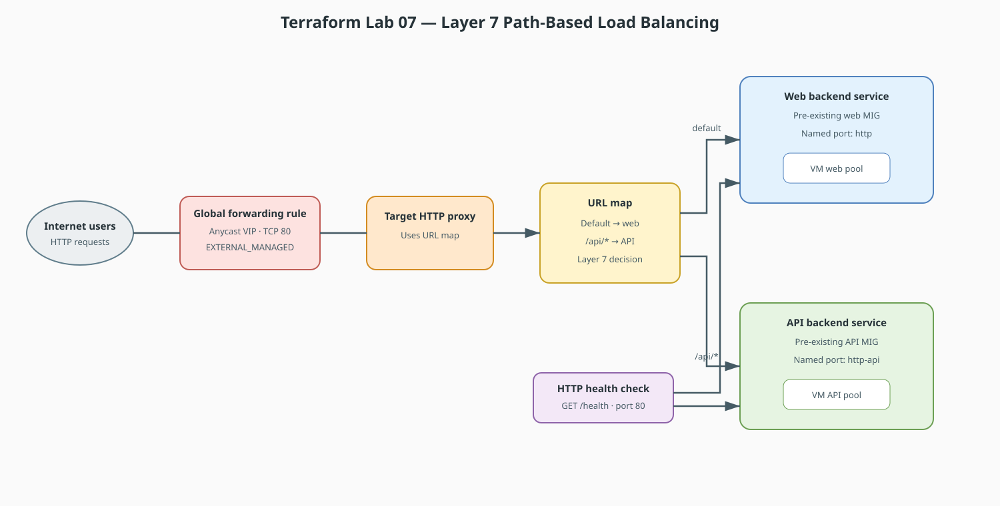

# Terraform Lab 07 — Layer 4 vs. Layer 7 Load Balancing

Load Balancers act as intelligent traffic dispatchers. This lab covers the difference between **Layer 4 (Transport / TCP/UDP)** and **Layer 7 (Application / HTTP/HTTPS)** Load Balancing.

## Lab contract

| Item | This lab |
|:-----|:---------|
| **Execution model** | Standalone focused scenario with a new working directory and state |
| **Starts from** | Two pre-existing managed instance groups supplied as input variables |
| **Creates** | The Layer 7 frontend and routing chain; it does not create backend VMs or groups |
| **Cost note** | Global forwarding and backend resources may incur charges; destroy after verification |
| **Next** | [Lab 08 — IPsec VPN & BGP](08-ipsec-vpn-bgp-hybrid.md) |

## Resource summary

| Terraform block | Count | Purpose |
|:----------------|------:|:--------|
| `google_compute_health_check.http_health` | 1 | Determines backend eligibility |
| `google_compute_backend_service` | 2 | Separate web and API backend pools |
| `google_compute_url_map.l7_url_map` | 1 | Sends `/api/*` to API and other paths to web |
| `google_compute_target_http_proxy.http_proxy` | 1 | Terminates the HTTP frontend and uses the URL map |
| `google_compute_global_forwarding_rule.forwarding_rule` | 1 | Creates the public TCP 80 entry point |
| `output.load_balancer_ip` | 1 | Exposes the assigned frontend address for verification |



!!! tip "Editable source"
    Edit [`lab07-l7-load-balancing.drawio`](../diagrams/lab07-l7-load-balancing.drawio) and export it as SVG after changes.

## Comparison Matrix: Layer 4 vs. Layer 7

| Feature | Layer 4 (Network Load Balancer) | Layer 7 (Application Load Balancer) |
|---|---|---|
| **OSI Layer** | Layer 4 (TCP / UDP) | Layer 7 (HTTP / HTTPS / gRPC) |
| **Inspection Capability**| IP addresses and Port numbers only | URLs, HTTP headers, Cookies, Query parameters |
| **Routing Capability** | Distributes to a single backend pool | Content-based routing (`/api` → API pool, `/images` → Storage) |
| **SSL/TLS Termination** | Pass-through (Client connects directly to VM) | Offloads TLS certificates at the edge; talks HTTP internally |
| **Performance** | Extreme throughput, lowest latency | Rich traffic management, URL rewrites, and security |

## Complete Terraform Configuration: L7 Cloud HTTP Load Balancer

```hcl
terraform {
  required_version = ">= 1.5.0"

  required_providers {
    google = {
      source  = "hashicorp/google"
      version = "~> 5.0"
    }
  }
}

provider "google" {
  project = var.project_id
}

variable "project_id" {
  description = "GCP project ID to deploy into"
  type        = string
}

variable "web_instance_group" {
  description = "Self-link of the managed instance group serving website traffic"
  type        = string
}

variable "api_instance_group" {
  description = "Self-link of the managed instance group serving API traffic"
  type        = string
}

# 1. Health Check (Probes backend VMs on port 80)
resource "google_compute_health_check" "http_health" {
  name               = "app-http-health-check"
  check_interval_sec = 5
  timeout_sec        = 3
  healthy_threshold   = 2
  unhealthy_threshold = 3

  http_health_check {
    port         = 80
    request_path = "/health"
  }
}

# 2. Backend Services (Groups of VMs serving specific traffic)
resource "google_compute_backend_service" "web_backend" {
  name                  = "web-backend-service"
  protocol              = "HTTP"
  port_name             = "http"
  load_balancing_scheme = "EXTERNAL_MANAGED"
  health_checks         = [google_compute_health_check.http_health.id]

  backend {
    group = var.web_instance_group
  }
}

resource "google_compute_backend_service" "api_backend" {
  name                  = "api-backend-service"
  protocol              = "HTTP"
  port_name             = "http-api"
  load_balancing_scheme = "EXTERNAL_MANAGED"
  health_checks         = [google_compute_health_check.http_health.id]

  backend {
    group = var.api_instance_group
  }
}

# 3. URL Map (The Layer 7 Routing Brain)
resource "google_compute_url_map" "l7_url_map" {
  name            = "prod-global-url-map"
  default_service = google_compute_backend_service.web_backend.id

  host_rule {
    hosts        = ["*"]
    path_matcher = "allpaths"
  }

  path_matcher {
    name            = "allpaths"
    default_service = google_compute_backend_service.web_backend.id

    # Content-based routing: /api/* routes to dedicated API instances
    path_rule {
      paths   = ["/api", "/api/*"]
      service = google_compute_backend_service.api_backend.id
    }
  }
}

# 4. Target HTTP Proxy
resource "google_compute_target_http_proxy" "http_proxy" {
  name    = "prod-http-proxy"
  url_map = google_compute_url_map.l7_url_map.id
}

# 5. Global Forwarding Rule (Public Entry Point with Anycast VIP)
resource "google_compute_global_forwarding_rule" "forwarding_rule" {
  name                  = "http-global-entry"
  target                = google_compute_target_http_proxy.http_proxy.id
  port_range            = "80"
  load_balancing_scheme = "EXTERNAL_MANAGED"
}

output "load_balancer_ip" {
  description = "Global frontend IP assigned to the HTTP load balancer"
  value       = google_compute_global_forwarding_rule.forwarding_rule.ip_address
}
```

## Apply and verify

Supply managed instance group self-links whose named ports match `http` and
`http-api`, and whose applications answer `/health` on port 80.

```bash
terraform init
terraform fmt
terraform validate
terraform apply \
  -var="project_id=YOUR_PROJECT_ID" \
  -var="web_instance_group=WEB_MIG_SELF_LINK" \
  -var="api_instance_group=API_MIG_SELF_LINK"

# 1. Fetch the Global Virtual IP assigned to the Load Balancer
VIP=$(terraform output -raw load_balancer_ip)

# 2. Test Default Route (Web Tier)
curl http://$VIP/
# Returns response from web_backend pool

# 3. Test Layer 7 Path-Based Route (/api)
curl http://$VIP/api/users
# Layer 7 URL Map automatically routes request to api_backend pool!
```

## Cleanup and next step

```bash
terraform destroy \
  -var="project_id=YOUR_PROJECT_ID" \
  -var="web_instance_group=WEB_MIG_SELF_LINK" \
  -var="api_instance_group=API_MIG_SELF_LINK"
```

This destroys only the load-balancer resources in this state; the pre-existing
managed instance groups remain. Continue to
[Lab 08 — IPsec VPN & BGP](08-ipsec-vpn-bgp-hybrid.md).
