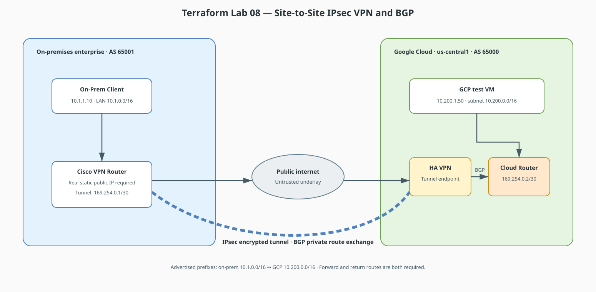

# Terraform Lab 08 — Site-to-Site IPsec VPN with BGP

This lab models a real-world **Hybrid Cloud Architecture**. You will connect an on-premises enterprise Cisco router to a Google Cloud Platform (GCP) Cloud VPN Gateway over the public internet, encrypting traffic with **IPsec (AES-256/SHA-256)** and dynamically exchanging routes using **BGP over a Virtual Tunnel Interface (VTI)**.

## Lab contract

| Item | This lab |
|:-----|:---------|
| **Execution model** | Standalone capstone with separate Cisco and Terraform configuration |
| **Starts from** | A reachable on-premises VPN gateway, one GCP project, and provider scaffolding from Lab 01 |
| **Creates** | GCP VPC/subnet/test VM, firewall policy, HA VPN, Cloud Router, one tunnel, and one BGP peer |
| **Availability scope** | One tunnel/interface for learning; production HA VPN normally uses redundant tunnels |
| **Ends with** | Verify IKE/IPsec, BGP, learned routes, and bidirectional private traffic; then destroy GCP resources |

## Resource summary

| Terraform block | Count | Purpose |
|:----------------|------:|:--------|
| `google_compute_network.cloud_vpc` | 1 | GCP routing domain |
| `google_compute_subnetwork.cloud_subnet` | 1 | Advertised GCP private prefix |
| `google_compute_instance.cloud_vm` | 1 | Private target at `10.200.1.50` for end-to-end verification |
| `google_compute_firewall.allow_onprem_icmp` | 1 | Permits ICMP only from the advertised on-premises prefix |
| `google_compute_ha_vpn_gateway.ha_gateway` | 1 | GCP VPN endpoint |
| `google_compute_external_vpn_gateway.onprem_gw` | 1 | Models the Cisco gateway's public interface |
| `google_compute_router.cloud_router` | 1 | GCP BGP control plane |
| `google_compute_vpn_tunnel.tunnel1` | 1 | One encrypted tunnel for the learning path |
| `google_compute_router_interface.router_interface1` | 1 | Link-local BGP attachment to the tunnel |
| `google_compute_router_peer.bgp_peer1` | 1 | Exchanges private prefixes with AS 65001 |



!!! tip "Editable source"
    Edit [`lab08-ipsec-bgp-hybrid.drawio`](../diagrams/lab08-ipsec-bgp-hybrid.drawio) and export it as SVG after changes.

## Addressing & IPsec Parameters

| Parameter | On-Premises Cisco Router | GCP Cloud VPN / Cloud Router |
|---|---|---|
| **Autonomous System (ASN)** | `65001` (Private BGP ASN) | `65000` (Google Cloud Router ASN) |
| **Public WAN IP** | `203.0.113.1` | `198.51.100.1` |
| **Inside BGP Tunnel IP** | `169.254.0.1/30` | `169.254.0.2/30` |
| **Local Private Network** | `10.1.0.0/16` | `10.200.0.0/16` |
| **IKEv2 / IPsec Cipher** | AES-256, SHA-256, DH Group 14 | AES-256, SHA-256, DH Group 14 |
| **Pre-Shared Key (PSK)** | Secure value supplied out of band | The same sensitive value through `var.vpn_shared_secret` |

!!! warning "Replace documentation addresses before deployment"
    `203.0.113.0/24` and `198.51.100.0/24` are reserved TEST-NET ranges and cannot establish a real internet VPN. Use the real static public IP of the on-premises gateway. After applying the HA VPN gateway, retrieve its assigned interface IP and substitute it anywhere the Cisco example shows `198.51.100.1`.

## 1. On-Premises Cisco Router Configuration (IOS CLI)

```text
enable
configure terminal
hostname On-Prem-Router

! 1. Physical Interface Addressing
interface GigabitEthernet0/0
 description On-Premises LAN
 ip address 10.1.1.1 255.255.0.0
 no shutdown
exit

interface GigabitEthernet0/1
 description Public Internet WAN Link
 ip address 203.0.113.1 255.255.255.252
 no shutdown
exit

! 2. Default Internet Route
ip route 0.0.0.0 0.0.0.0 203.0.113.2

! -----------------------------------------------------------------------------
! 3. IPSEC PHASE 1 (IKEv2 Proposal & Policy)
! -----------------------------------------------------------------------------
crypto ikev2 proposal GCP-IKE-PROPOSAL
 encryption aes-cbc-256
 integrity sha256
 group 14
exit

crypto ikev2 policy GCP-IKE-POLICY
 proposal GCP-IKE-PROPOSAL
exit

crypto ikev2 keyring GCP-KEYRING
 peer GCP-PEER
  address 198.51.100.1
  pre-shared-key <PSK_FROM_SECURE_INPUT>
 exit
exit

crypto ikev2 profile GCP-IKE-PROFILE
 match address local 203.0.113.1
 match identity remote address 198.51.100.1 255.255.255.255
 authentication remote pre-share
 authentication local pre-share
 keyring local GCP-KEYRING
 lifetime 36000
exit

! -----------------------------------------------------------------------------
! 4. IPSEC PHASE 2 (Transform Set & Profile)
! -----------------------------------------------------------------------------
crypto ipsec transform-set GCP-TRANSFORM esp-aes 256 esp-sha256-hmac
 mode tunnel
exit

crypto ipsec profile GCP-IPSEC-PROFILE
 set transform-set GCP-TRANSFORM
 set ikev2-profile GCP-IKE-PROFILE
exit

! -----------------------------------------------------------------------------
! 5. ROUTE-BASED VIRTUAL TUNNEL INTERFACE (VTI)
! -----------------------------------------------------------------------------
interface Tunnel1
 description IPsec VTI Tunnel to GCP Cloud
 ip address 169.254.0.1 255.255.255.252
 ip mtu 1460
 ip tcp adjust-mss 1420
 tunnel source GigabitEthernet0/1
 tunnel mode ipsec ipv4
 tunnel destination 198.51.100.1
 tunnel protection ipsec profile GCP-IPSEC-PROFILE
 no shutdown
exit

! -----------------------------------------------------------------------------
! 6. BGP ROUTING OVER THE IPSEC TUNNEL
! -----------------------------------------------------------------------------
router bgp 65001
 bgp router-id 1.1.1.1
 neighbor 169.254.0.2 remote-as 65000
 neighbor 169.254.0.2 description Peering-to-GCP-Cloud-Router
 neighbor 169.254.0.2 timers 20 60
 ! Advertise On-Prem LAN to GCP
 network 10.1.0.0 mask 255.255.0.0
exit

ip route 10.1.0.0 255.255.0.0 Null0

end
write memory
```

## 2. GCP Cloud Side Configuration (Terraform Code)

```hcl
terraform {
  required_version = ">= 1.5.0"

  required_providers {
    google = {
      source  = "hashicorp/google"
      version = "~> 5.0"
    }
  }
}

provider "google" {
  project = var.project_id
  region  = var.region
}

variable "project_id" {
  description = "GCP project ID to deploy into"
  type        = string
}

variable "region" {
  description = "GCP region for the VPN resources"
  type        = string
  default     = "us-central1"
}

variable "vpn_shared_secret" {
  description = "Pre-shared key configured identically on both VPN peers"
  type        = string
  sensitive   = true
}

# 1. VPC Network and Subnet
resource "google_compute_network" "cloud_vpc" {
  name                    = "gcp-prod-vpc"
  auto_create_subnetworks = false
}

resource "google_compute_subnetwork" "cloud_subnet" {
  name          = "cloud-app-subnet"
  ip_cidr_range = "10.200.0.0/16"
  region        = var.region
  network       = google_compute_network.cloud_vpc.id
}

resource "google_compute_instance" "cloud_vm" {
  name         = "gcp-cloud-vm"
  machine_type = "e2-micro"
  zone         = "${var.region}-a"

  boot_disk {
    initialize_params {
      image = "debian-cloud/debian-12"
    }
  }

  network_interface {
    subnetwork = google_compute_subnetwork.cloud_subnet.id
    network_ip = "10.200.1.50"
  }
}

resource "google_compute_firewall" "allow_onprem_icmp" {
  name    = "allow-onprem-icmp"
  network = google_compute_network.cloud_vpc.id

  source_ranges = ["10.1.0.0/16"]

  allow {
    protocol = "icmp"
  }
}

# 2. HA Cloud VPN Gateway
resource "google_compute_ha_vpn_gateway" "ha_gateway" {
  name    = "gcp-to-onprem-vpn"
  network = google_compute_network.cloud_vpc.id
  region  = var.region
}

# 3. Cloud Router with BGP ASN 65000
resource "google_compute_router" "cloud_router" {
  name    = "gcp-hybrid-router"
  network = google_compute_network.cloud_vpc.name
  region  = var.region
  bgp {
    asn = 65000
  }
}

# 4. External Peer Gateway (Points to On-Prem Public IP)
resource "google_compute_external_vpn_gateway" "onprem_gw" {
  name            = "onprem-cisco-gateway"
  redundancy_type = "SINGLE_IP_INTERNALLY_REDUNDANT"
  interface {
    id         = 0
    ip_address = "203.0.113.1"
  }
}

# 5. VPN Tunnel (IPsec)
resource "google_compute_vpn_tunnel" "tunnel1" {
  name                            = "vpn-tunnel-to-onprem"
  region                          = var.region
  vpn_gateway                     = google_compute_ha_vpn_gateway.ha_gateway.id
  peer_external_gateway           = google_compute_external_vpn_gateway.onprem_gw.id
  peer_external_gateway_interface = 0
  shared_secret                   = var.vpn_shared_secret
  router                          = google_compute_router.cloud_router.id
  vpn_gateway_interface           = 0
}

# 6. Cloud Router BGP Interface and Peer
resource "google_compute_router_interface" "router_interface1" {
  name       = "router-if-1"
  router     = google_compute_router.cloud_router.name
  region     = var.region
  ip_range   = "169.254.0.2/30"
  vpn_tunnel = google_compute_vpn_tunnel.tunnel1.name
}

resource "google_compute_router_peer" "bgp_peer1" {
  name                      = "bgp-peer-onprem"
  router                    = google_compute_router.cloud_router.name
  region                    = var.region
  peer_ip_address           = "169.254.0.1"
  peer_asn                  = 65001
  interface                 = google_compute_router_interface.router_interface1.name
  advertised_route_priority = 100
}
```

## 3. Apply, Verify & Troubleshoot

Store the PSK outside version control and pass it through an environment variable
or an uncommitted `.tfvars` file. For example:

```bash
export TF_VAR_vpn_shared_secret='REPLACE_WITH_A_STRONG_SHARED_SECRET'
terraform init
terraform fmt
terraform validate
terraform apply -var="project_id=YOUR_PROJECT_ID"
```

Configure the identical secret on the Cisco peer through an approved secure
process; do not commit it to the router configuration stored in this repository.

On **On-Premises Cisco Router**:
```text
show crypto ikev2 sa         # Verify IPsec Phase 1 tunnel status
show crypto ipsec sa          # Verify Phase 2 encryption/decryption counters
show ip bgp summary           # Confirm BGP session is in "Established" state
show ip route bgp             # Verify GCP 10.200.0.0/16 route is dynamically learned
ping 10.200.1.50 source 10.1.1.1  # End-to-end encrypted ping test
```

## Cleanup

Remove or disable the Cisco-side test configuration after the GCP tunnel is no
longer needed, then destroy the Terraform-managed resources:

```bash
terraform destroy -var="project_id=YOUR_PROJECT_ID"
unset TF_VAR_vpn_shared_secret
```

Confirm that the VPN tunnel, external gateway model, Cloud Router, test VM,
firewall rule, subnet, and VPC have been removed.
